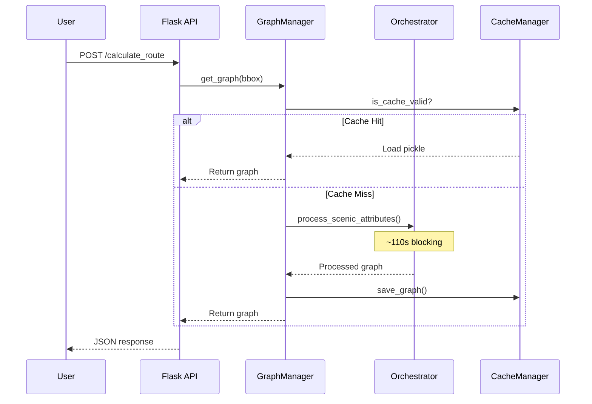
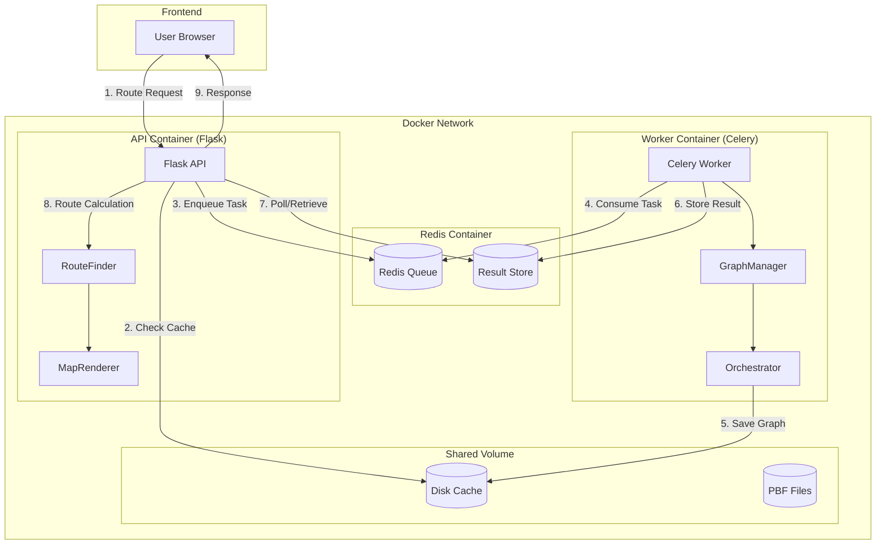
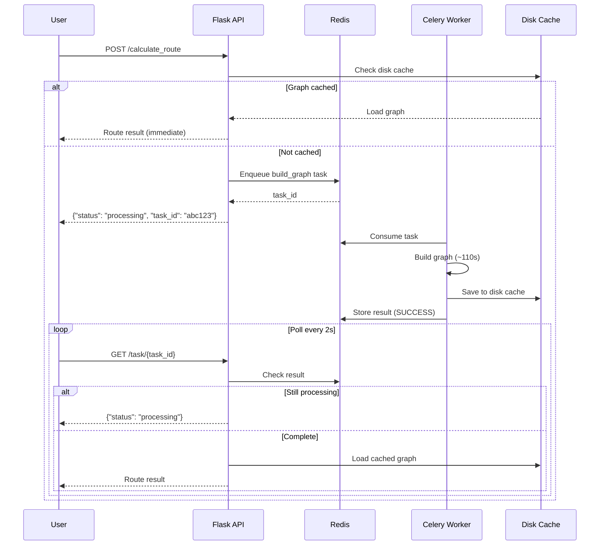
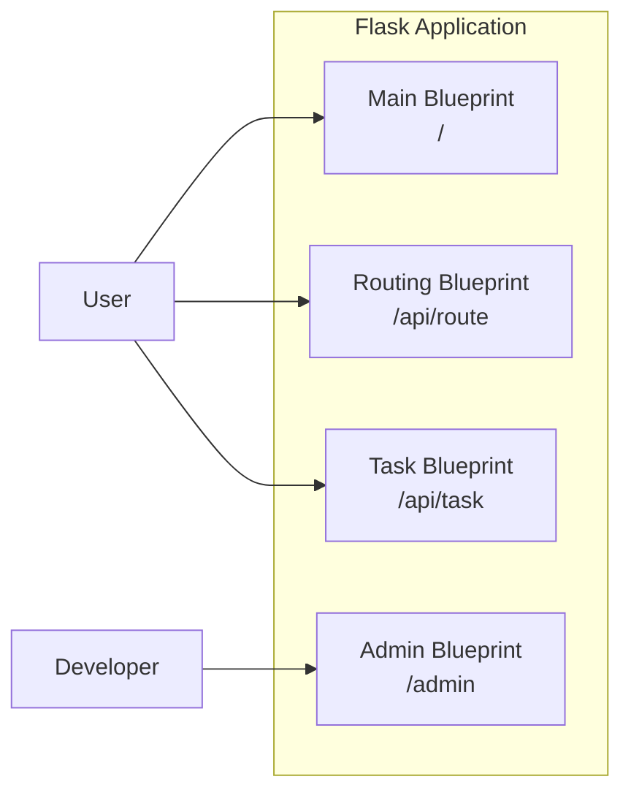

# Asynchronous Graph Build Pipeline

---

## 1. Executive Summary

This document details the implementation plan for decoupling graph construction from the Flask routing API using Celery and Redis. The goal is to move expensive graph processing (~110 seconds on first load, just for Bristol - which is small considering) into background workers, enabling:

- **Non-blocking API**: Routing requests return immediately or poll for status
- **Horizontal scaling**: Multiple workers can process different regions concurrently
- **Pre-computation**: Graphs can be built ahead of time for anticipated regions
- **Resilience**: Failed builds can be retried without affecting the API

---

## 2. Current Architecture Analysis

### 2.1 Synchronous Flow (Current)



**Problem**: The entire request blocks for up to 110 seconds on cache miss.

### 2.2 Key Files in Current Architecture

| File | Responsibility | Lines |
|------|----------------|-------|
| [routes.py](file:///c:/Users/jacob/OneDrive%20-%20UWE%20Bristol/Computer%20Science/Year%203/(Dis)%20Digital%20Systems%20Project/Programming/ScenicPathFinder/app/routes.py) | Flask endpoints, geocoding, route calculation | 338 |
| [graph_manager.py](file:///c:/Users/jacob/OneDrive%20-%20UWE%20Bristol/Computer%20Science/Year%203/(Dis)%20Digital%20Systems%20Project/Programming/ScenicPathFinder/app/services/core/graph_manager.py) | Two-tier cache, graph loading orchestration | 287 |
| [orchestrator.py](file:///c:/Users/jacob/OneDrive%20-%20UWE%20Bristol/Computer%20Science/Year%203/(Dis)%20Digital%20Systems%20Project/Programming/ScenicPathFinder/app/services/processors/orchestrator.py) | Sequential scenic processing pipeline | 149 |
| [cache_manager.py](file:///c:/Users/jacob/OneDrive%20-%20UWE%20Bristol/Computer%20Science/Year%203/(Dis)%20Digital%20Systems%20Project/Programming/ScenicPathFinder/app/services/core/cache_manager.py) | Disk cache with version validation | 248 |
| [config.py](file:///c:/Users/jacob/OneDrive%20-%20UWE%20Bristol/Computer%20Science/Year%203/(Dis)%20Digital%20Systems%20Project/Programming/ScenicPathFinder/config.py) | Application configuration | 72 |

### 2.3 Processing Time Breakdown (Bristol, 325K edges)

| Stage | Time |
|-------|------|
| Graph Loading (PBF parse) | ~16s |
| Quietness Processing | ~0.4s |
| Greenness Processing (EDGE_SAMPLING) | ~45s |
| Water Processing | ~26s |
| Social Processing | ~13s |
| Normalisation | ~2s |
| **Total** | **~110s** |

---

## 3. Proposed Architecture

### 3.1 High-Level Design



### 3.2 Container Strategy

| Container | Purpose | Image Base | Replicas |
|-----------|---------|------------|----------|
| **scenic-api** | Flask routing API, lightweight request handling | `python:3.11-slim` | 1 |
| **scenic-worker** | Celery worker, heavy graph processing | `python:3.11-slim` | 1–N |
| **redis** | Message broker and result backend | `redis:7-alpine` | 1 |

> [!NOTE]
> Start with a single worker replica. Scale horizontally by increasing worker replicas when processing multiple regions concurrently.

### 3.3 Communication Flow



---

## 4. File Changes Specification

### 4.1 New Files

| File | Purpose |
|------|---------|
| `celery_app.py` | Celery application factory and configuration |
| `app/tasks/__init__.py` | Task package initialisation |
| `app/tasks/graph_blueprints/tasks.py` | Celery tasks for graph building |
| `docker-compose.yml` | Container orchestration |
| `Dockerfile` | Application container build |
| `docker/Dockerfile.worker` | Worker-specific container (optional) |
| `.env` | Environment variables |

### 4.2 Modified Files

| File | Changes |
|------|---------|
| [routes.py](file:///c:/Users/jacob/OneDrive%20-%20UWE%20Bristol/Computer%20Science/Year%203/(Dis)%20Digital%20Systems%20Project/Programming/ScenicPathFinder/app/routes.py) | Add `/task/{id}` endpoint, async response handling |
| [graph_manager.py](file:///c:/Users/jacob/OneDrive%20-%20UWE%20Bristol/Computer%20Science/Year%203/(Dis)%20Digital%20Systems%20Project/Programming/ScenicPathFinder/app/services/core/graph_manager.py) | Remove Flask dependencies, make stateless for worker |
| [config.py](file:///c:/Users/jacob/OneDrive%20-%20UWE%20Bristol/Computer%20Science/Year%203/(Dis)%20Digital%20Systems%20Project/Programming/ScenicPathFinder/config.py) | Add Redis/Celery config, async mode toggle |
| [requirements.txt](file:///c:/Users/jacob/OneDrive%20-%20UWE%20Bristol/Computer%20Science/Year%203/(Dis)%20Digital%20Systems%20Project/Programming/ScenicPathFinder/requirements.txt) | Add `celery`, `redis` dependencies |

### 4.3 Proposed Directory Structure

```diff
 ScenicPathFinder/
 ├── app/
 │   ├── services/
 │   │   ├── core/
+│   │   │   ├── graph_builder.py    # Stateless graph building (extracted from GraphManager)
 │   │   │   ├── cache_manager.py
 │   │   │   ├── data_loader.py
 │   │   │   └── graph_manager.py    # Thin wrapper, delegates to builder
 │   │   └── ...
+│   ├── tasks/
+│   │   ├── __init__.py
+│   │   └── graph_blueprints/tasks.py          # Celery task definitions
 │   ├── routes.py
 │   └── ...
+├── celery_app.py                    # Celery application factory
+├── docker-compose.yml
+├── Dockerfile
+├── docker/
+│   └── Dockerfile.worker            # Optional worker-specific image
+├── .env
 ├── config.py
 ├── requirements.txt
 └── run.py
```

---

## 5. Implementation Details

### 5.1 Celery Application (`celery_app.py`)

```python
from celery import Celery
import os

def make_celery():
    """Create Celery application with Redis broker."""
    broker_url = os.environ.get('CELERY_BROKER_URL', 'redis://localhost:6379/0')
    result_backend = os.environ.get('CELERY_RESULT_BACKEND', 'redis://localhost:6379/1')
    
    celery = Celery(
        'scenic_worker',
        broker=broker_url,
        backend=result_backend,
        include=['app.tasks.graph_tasks']
    )
    
    celery.conf.update(
        task_serializer='pickle',         # Required for NetworkX graphs
        accept_content=['pickle', 'json'],
        result_serializer='pickle',
        task_track_started=True,
        task_time_limit=600,              # 10 minute timeout, maybe we change it later as Novack is very expensive
        worker_prefetch_multiplier=1,     # Process one task at a time
    )
    
    return celery

celery = make_celery()
```

### 5.2 Graph Building Task (`app/tasks/graph_blueprints/tasks.py`)

```python
from celery_app import celery
from celery import states
from app.services.core.graph_builder import GraphBuilder
from app.services.core.cache_manager import get_cache_manager

@celery.task(bind=True, max_retries=2)
def build_graph_task(self, region_name: str, bbox: tuple, 
                     greenness_mode: str, elevation_mode: str) -> dict:
    """
    Build and cache a graph for the specified region.
    
    Returns status dict with cache_key on success.
    """
    self.update_state(state='BUILDING', meta={'region': region_name})
    
    try:
        builder = GraphBuilder()
        graph, timings = builder.build_graph(
            region_name=region_name,
            bbox=bbox,
            greenness_mode=greenness_mode,
            elevation_mode=elevation_mode
        )
        
        cache_manager = get_cache_manager()
        cache_manager.save_graph(
            graph, region_name, greenness_mode, elevation_mode
        )
        
        return {
            'status': 'complete',
            'region': region_name,
            'node_count': graph.number_of_nodes(),
            'edge_count': graph.number_of_edges(),
            'timings': timings
        }
        
    except Exception as e:
        self.update_state(state=states.FAILURE, meta={'error': str(e)})
        raise
```

### 5.3 API Endpoint Changes (`routes.py`)

```python
from celery.result import AsyncResult
from app.tasks.graph_tasks import build_graph_task

@main.route('/api/task/<task_id>', methods=['GET'])
def get_task_status(task_id: str):
    """Poll for task completion status."""
    result = AsyncResult(task_id)
    
    if result.state == 'PENDING':
        response = {'status': 'pending', 'task_id': task_id}
    elif result.state == 'BUILDING':
        response = {'status': 'building', 'region': result.info.get('region')}
    elif result.state == 'SUCCESS':
        response = {'status': 'complete', 'result': result.result}
    else:
        response = {'status': 'failed', 'error': str(result.info)}
    
    return jsonify(response)

# In calculate_route():
# Check cache first, if miss → enqueue and return task_id
```

### 5.4 Docker Compose (`docker-compose.yml`)

```yaml
version: '3.8'

services:
  redis:
    image: redis:7-alpine
    ports:
      - "6379:6379"
    volumes:
      - redis_data:/data
    healthcheck:
      test: ["CMD", "redis-cli", "ping"]
      interval: 5s
      timeout: 3s
      retries: 5

  api:
    build:
      context: .
      dockerfile: Dockerfile
    ports:
      - "5000:5000"
    environment:
      - FLASK_ENV=development
      - CELERY_BROKER_URL=redis://redis:6379/0
      - CELERY_RESULT_BACKEND=redis://redis:6379/1
    volumes:
      - ./app/data:/app/app/data  # Shared cache + PBF files
    depends_on:
      redis:
        condition: service_healthy

  worker:
    build:
      context: .
      dockerfile: Dockerfile
    command: celery -A celery_app worker --loglevel=info --concurrency=4
    environment:
      - CELERY_BROKER_URL=redis://redis:6379/0
      - CELERY_RESULT_BACKEND=redis://redis:6379/1
    volumes:
      - ./app/data:/app/app/data  # Shared cache + PBF files
    depends_on:
      redis:
        condition: service_healthy

volumes:
  redis_data:
```

### 5.5 Dockerfile

```dockerfile
FROM python:3.11-slim

WORKDIR /app

# Install system dependencies for geospatial libraries
RUN apt-get update && apt-get install -y \
    libgeos-dev \
    libproj-dev \
    libgdal-dev \
    && rm -rf /var/lib/apt/lists/*

COPY requirements.txt .
RUN pip install --no-cache-dir -r requirements.txt

COPY . .

# Default: run Flask API
CMD ["python", "run.py"]
```

---

## 5.6 Flask Route Separation & Admin Panel

### 5.6.1 Blueprint Architecture

With the async pipeline, the Flask API should be split into distinct **Blueprints** for separation of concerns:



| Blueprint | URL Prefix | Purpose | Access |
|-----------|------------|---------|--------|
| **main** | `/` | Index page, map UI | Public |
| **routing** | `/api/route` | Route calculation, geocoding | Public |
| **tasks** | `/api/task` | Task polling, status checks | Public |
| **admin** | `/admin` | Cache management, task monitoring | Development/Auth |

### 5.6.2 Updated Directory Structure

```diff
 app/
+├── blueprints/
+│   ├── __init__.py
+│   ├── main.py           # Index route, map UI
+│   ├── routing.py        # Route calculation endpoints
+│   ├── blueprints/tasks.py          # Task status polling
+│   └── admin.py          # Admin panel endpoints
 ├── routes.py             # Legacy (to be deprecated/refactored)
 ├── templates/
+│   ├── admin/
+│   │   ├── dashboard.html
+│   │   └── tasks.html
 │   └── index.html
 └── ...
```

### 5.6.3 Admin Panel Endpoints

The admin panel provides visibility into the async pipeline for debugging and monitoring:

| Endpoint | Method | Description |
|----------|--------|-------------|
| `/admin/` | GET | Dashboard overview |
| `/admin/cache` | GET | View cached regions, sizes, timestamps |
| `/admin/cache/<region>` | DELETE | Invalidate specific cache |
| `/admin/cache/clear` | POST | Clear all caches |
| `/admin/tasks` | GET | View all task history |
| `/admin/tasks/active` | GET | View currently running tasks |
| `/admin/tasks/<id>` | GET | Detailed task info |
| `/admin/tasks/<id>/cancel` | POST | Cancel a running task |
| `/admin/workers` | GET | Worker status and heartbeats |
| `/admin/config` | GET | Current processing configuration |

### 5.6.4 Admin Blueprint Implementation

```python
# app/blueprints/admin.py
from flask import Blueprint, render_template, jsonify, current_app
from celery.result import AsyncResult
from celery_app import celery
from app.services.core.cache_manager import get_cache_manager

admin = Blueprint('admin', __name__, url_prefix='/admin')


@admin.route('/')
def dashboard():
    """Admin dashboard with overview statistics."""
    cache_manager = get_cache_manager()
    cache_stats = cache_manager.get_cache_stats()
    
    # Get active tasks from Celery
    inspect = celery.control.inspect()
    active_tasks = inspect.active() or {}
    
    return render_template('admin/dashboard.html',
        cache_stats=cache_stats,
        active_tasks=active_tasks,
        config={
            'greenness_mode': current_app.config.get('GREENNESS_MODE'),
            'elevation_mode': current_app.config.get('ELEVATION_MODE'),
            'water_mode': current_app.config.get('WATER_MODE'),
            'async_mode': current_app.config.get('ASYNC_MODE', True),
        }
    )


@admin.route('/cache')
def list_cache():
    """List all cached regions with metadata."""
    cache_manager = get_cache_manager()
    return jsonify({
        'cached_regions': cache_manager.get_cache_stats(),
        'cache_directory': str(cache_manager.cache_dir),
    })


@admin.route('/cache/<region>', methods=['DELETE'])
def invalidate_cache(region: str):
    """Invalidate cache for a specific region."""
    cache_manager = get_cache_manager()
    # Implementation: remove specific region cache
    return jsonify({'status': 'invalidated', 'region': region})


@admin.route('/tasks')
def list_tasks():
    """List recent task history."""
    # Query Redis for task results
    # This would use flower's API or direct Redis queries
    return jsonify({'tasks': []})  # Placeholder


@admin.route('/tasks/active')
def active_tasks():
    """List currently running tasks."""
    inspect = celery.control.inspect()
    active = inspect.active() or {}
    reserved = inspect.reserved() or {}
    
    return jsonify({
        'active': active,
        'reserved': reserved,
    })


@admin.route('/workers')
def worker_status():
    """Get status of all Celery workers."""
    inspect = celery.control.inspect()
    
    return jsonify({
        'ping': inspect.ping() or {},
        'stats': inspect.stats() or {},
        'registered': inspect.registered() or {},
    })
```

### 5.6.5 Admin Dashboard Template (Minimal)

```html
<!-- app/templates/admin/dashboard.html -->
<!DOCTYPE html>
<html>
<head>
    <title>ScenicPathFinder Admin</title>
    <style>
        body { font-family: system-ui; padding: 2rem; }
        .card { border: 1px solid #ddd; padding: 1rem; margin: 1rem 0; border-radius: 8px; }
        .status-ok { color: green; }
        .status-error { color: red; }
        table { width: 100%; border-collapse: collapse; }
        th, td { padding: 0.5rem; text-align: left; border-bottom: 1px solid #eee; }
    </style>
</head>
<body>
    <h1>🗺️ ScenicPathFinder Admin</h1>
    
    <div class="card">
        <h2>Configuration</h2>
        <table>
            <tr><td>Greenness Mode</td><td>{{ config.greenness_mode }}</td></tr>
            <tr><td>Elevation Mode</td><td>{{ config.elevation_mode }}</td></tr>
            <tr><td>Water Mode</td><td>{{ config.water_mode }}</td></tr>
            <tr><td>Async Mode</td><td>{{ config.async_mode }}</td></tr>
        </table>
    </div>
    
    <div class="card">
        <h2>Cache Status</h2>
        <p>Cached Regions: {{ cache_stats.total_entries }}</p>
        <p>Total Size: {{ cache_stats.total_size_mb }} MB</p>
    </div>
    
    <div class="card">
        <h2>Active Tasks</h2>
        
            <ul>
            
                <li>{{ worker }}: {{ tasks|length }} task(s)</li>
            
            </ul>
        
            <p>No active tasks</p>
        
    </div>
    
    <div class="card">
        <h2>Actions</h2>
        <button onclick="clearCache()">Clear All Cache</button>
        <button onclick="refreshWorkers()">Refresh Workers</button>
    </div>
</body>
</html>
```

### 5.6.6 Implementation Sequencing for Admin Panel

> [!TIP]
> **Build the admin panel ALONGSIDE the core async pipeline, not before or after.**

| Approach | Pros | Cons |
|----------|------|------|
| **Admin first** | Immediate visibility | Nothing to monitor yet; wasted effort if architecture changes |
| **Admin after** | Core working first | Debugging async issues without visibility is painful |
| **Admin alongside** ✅ | Visibility as you build; catches issues early | Slightly more parallel work |

**Recommended Phasing:**

```
Phase 1A: Core Celery + Redis setup
Phase 1B: Basic /admin/tasks/active endpoint (minimal)

Phase 2A: Graph build task implementation  
Phase 2B: /admin/cache endpoint

Phase 3A: Route integration with async flow
Phase 3B: Full admin dashboard UI
```

### 5.6.7 Security Considerations

> 
> The admin panel exposes internal state and cache manipulation. Secure it in production. But this is going to be testing for a while so no worry.

| Environment | Security |
|-------------|----------|
| **Development** | No auth (localhost only) |
| **Staging** | Basic auth or IP whitelist |
| **Production** | OAuth/SSO, or disable entirely |

```python
# Simple development-only guard
@admin.before_request
def check_admin_access():
    if not current_app.debug:
        # In production, require authentication
        # abort(403) or redirect to login
        pass
```

---

## 6. Multithreading Considerations

### 6.1 Implementation Sequencing Recommendation

> [!IMPORTANT]  
> **Implement distributed pipeline (Celery/Redis) FIRST, then add multithreading within workers.**

| Phase | Focus | Reasoning |
|-------|-------|-----------|
| **Phase 1** | Celery + Redis (single-threaded workers) | Establishes message passing, result tracking, and debugging infrastructure |
| **Phase 2** | Multithreaded processing within workers | Can debug threading issues in isolation with established observability |

### 6.2 Why This Order?

1. **Distributed debugging is harder than threading debugging**  
   With Celery, issues span multiple processes/containers. Establish logging, monitoring, and task tracking first.

2. **Celery provides retry/failure handling**  
   Threading bugs cause silent failures; Celery surfaces them as task failures.

3. **Incremental complexity**  
   Single-threaded workers are correct by default. Add threading only after baseline works.

4. **Observability first**  
   Celery provides Flower (monitoring UI), logging, and result tracking—essential for debugging threading issues later.

### 6.3 Multithreading Opportunities

Once the distributed pipeline is stable, parallelise within the `GraphBuilder`:

```python
from concurrent.futures import ThreadPoolExecutor, as_completed

def process_scenic_attributes_parallel(graph, loader, timings):
    """Run scenic processors in parallel where safe."""
    
    with ThreadPoolExecutor(max_workers=4) as executor:
        futures = {}
        
        # These are independent and can run concurrently
        if greenness_mode != 'OFF':
            futures['greenness'] = executor.submit(
                process_greenness, graph, loader.extract_green_areas()
            )
        if water_mode != 'OFF':
            futures['water'] = executor.submit(
                process_water, graph, loader.extract_water()
            )
        if social_mode != 'OFF':
            futures['social'] = executor.submit(
                process_social, graph, loader.extract_pois()
            )
        
        for name, future in as_completed(futures.values()):
            # Merge results into graph
            ...
```

### 6.4 Thread Safety Considerations

| Component | Thread-Safe? | Mitigation |
|-----------|--------------|------------|
| NetworkX graph mutations | **No** | Use separate graphs per processor, merge after |
| GeoDataFrame operations | **Yes** (read-only) | Safe for concurrent spatial queries |
| Disk cache writes | **No** | Use file locking or sequential save |
| R-tree spatial index | **Yes** (read-only) | Build once, query concurrently |

> [!CAUTION]
> **Never mutate the same graph object from multiple threads.** Either:
> 1. Copy edge attributes to separate dicts, merge after
> 2. Use `ThreadPoolExecutor` only for independent feature extraction, apply sequentially

---

## 7. Local Development Setup

### 7.1 Prerequisites

| Software | Version | Purpose |
|----------|---------|---------|
| Docker Desktop | 4.x+ | Container runtime |
| Docker Compose | 2.x+ | Multi-container orchestration |
| Python | 3.11+ | Local development/testing |
| Redis (optional) | 7.x | Local Redis for non-Docker testing |

### 7.2 Quick Start

```powershell
# 1. Clone and navigate to project
cd ScenicPathFinder

# 2. Create .env file
echo "FLASK_ENV=development" > .env
echo "CELERY_BROKER_URL=redis://localhost:6379/0" >> .env
echo "CELERY_RESULT_BACKEND=redis://localhost:6379/1" >> .env

# 3. Start all services
docker-compose up --build

# 4. Access the application
# API: http://localhost:5000
# Redis: localhost:6379
```

### 7.3 Running Without Docker (Development)

```powershell
# Terminal 1: Start Redis
docker run -p 6379:6379 redis:7-alpine

# Terminal 2: Start Celery worker
celery -A celery_app worker --loglevel=info

# Terminal 3: Start Flask
python run.py
```

### 7.4 Environment Variables

| Variable | Default | Description |
|----------|---------|-------------|
| `CELERY_BROKER_URL` | `redis://localhost:6379/0` | Redis broker connection |
| `CELERY_RESULT_BACKEND` | `redis://localhost:6379/1` | Redis result storage |
| `ASYNC_MODE` | `true` | Enable async graph building |
| `WORKER_CONCURRENCY` | `1` | Celery worker thread count |

---

## 8. Debugging Practices

### 8.1 Logging Strategy

```python
# In celery_app.py
import logging

logging.basicConfig(
    level=logging.INFO,
    format='%(asctime)s [%(levelname)s] %(name)s: %(message)s'
)

# In graph_blueprints/tasks.py
import logging
logger = logging.getLogger(__name__)

@celery.task(bind=True)
def build_graph_task(self, region_name, ...):
    logger.info(f"Starting graph build for {region_name}")
    logger.info(f"Task ID: {self.request.id}")
    try:
        ...
        logger.info(f"Graph built: {graph.number_of_nodes()} nodes")
    except Exception as e:
        logger.exception(f"Graph build failed: {e}")
        raise
```

### 8.2 Celery Flower (Monitoring UI)

```powershell
# Add to docker-compose.yml for production debugging:
flower:
  image: mher/flower
  ports:
    - "5555:5555"
  environment:
    - CELERY_BROKER_URL=redis://redis:6379/0
  depends_on:
    - redis
```

Access at `http://localhost:5555` for:
- Task history and status
- Worker status and heartbeats
- Task timing and failure rates

### 8.3 Troubleshooting Guide

| Symptom | Likely Cause | Solution |
|---------|--------------|----------|
| Task stuck in PENDING | Worker not running or not connected to Redis | Check `docker-compose logs worker` |
| "Connection refused" to Redis | Redis not started or wrong port | Verify `docker-compose ps`, check Redis health |
| Graph not appearing in cache | Volume mount mismatch | Ensure same path in API and worker containers |
| Pickle serialisation errors | NetworkX version mismatch | Pin `networkx` version in requirements.txt |
| Worker crashes during processing | Memory exhaustion | Reduce `worker_concurrency`, add `--max-memory-per-child` |
| Task timeout (10 min) | Large region, slow disk | Increase `task_time_limit`, use SSD storage |

### 8.4 Debugging Commands

```powershell
# Check Redis connection
docker exec -it $(docker ps -qf "ancestor=redis:7-alpine") redis-cli ping

# View Celery worker logs
docker-compose logs -f worker

# Inspect task result
docker exec -it $(docker ps -qf "ancestor=redis:7-alpine") redis-cli get celery-task-meta-<task_id>

# List active tasks
celery -A celery_app inspect active

# Purge all pending tasks (careful!)
celery -A celery_app purge
```

### 8.5 Common Errors and Fixes

**Error: `kombu.exceptions.OperationalError: [Errno 111] Connection refused`**
```powershell
# Redis not running. Start it:
docker run -d -p 6379:6379 redis:7-alpine
```

**Error: `AttributeError: Can't pickle local object`**
```python
# Ensure all objects passed to tasks are serialisable
# Use primitives (str, dict) instead of complex objects
build_graph_task.delay(region_name, tuple(bbox), greenness_mode, elevation_mode)
```

**Error: `Task exceeded time limit`**
```python
# Increase in celery_app.py
celery.conf.update(
    task_time_limit=1200,  # 20 minutes
    task_soft_time_limit=1100,
)
```

---

## 9. Verification Plan

### 9.1 Unit Tests

- [ ] Test `build_graph_task` with mock graph builder
- [ ] Test task state transitions (PENDING → BUILDING → SUCCESS)
- [ ] Test cache integration (task saves, API loads)

### 9.2 Integration Tests

- [ ] End-to-end: Request → task enqueue → poll → result
- [ ] Cache miss triggers task, cache hit skips
- [ ] Worker restart recovers pending tasks

### 9.3 Manual Verification

1. Start Docker Compose stack
2. Make route request with cache miss
3. Observe task enqueued (logs)
4. Poll `/api/task/{id}` until complete
5. Verify graph cached on disk
6. Repeat request (should hit cache, no task)

---

## 10. Rollback Strategy

If async mode causes issues, the system can fall back to synchronous mode:

```python
# In config.py
ASYNC_MODE = False  # Disable async, use synchronous GraphManager.get_graph()
```

The existing synchronous code path remains intact, activated when `ASYNC_MODE=False`.

---

## 11. Critical Concerns & Mitigations

### 11.1 Scope Consideration: Is This Necessary?

> [!IMPORTANT]
> Before implementing, honestly assess whether this complexity is justified for your use case.

| If your goal is... | Then... |
|--------------------|---------|
| **Production-ready SaaS** | Yes, Celery/Redis is the correct solution |
| **Dissertation demo** | Potentially overkill — pre-cache key regions and accept 110s first-load |
| **Learning distributed systems** | Great project, but acknowledge scope creep |

**Alternative (simpler):** A basic `threading.Thread` with status polling achieves 80% of the benefit with 20% of the complexity:

```python
# Simpler alternative (no Celery/Redis infrastructure)
import threading
import uuid

building_tasks = {}  # In-memory task tracking

@app.route('/calculate_route', methods=['POST'])
def calculate_route():
    if not cache_hit:
        task_id = str(uuid.uuid4())
        thread = threading.Thread(target=build_graph_async, args=(task_id, bbox))
        thread.start()
        building_tasks[task_id] = {'status': 'building', 'region': region_name}
        return jsonify({'status': 'processing', 'task_id': task_id})
```

**Verdict:** Celery is the *production-grade* answer, but evaluate if the infrastructure overhead is worth it for your timeline.

---

### 11.2 Race Condition: Duplicate Tasks

**Problem:** If two users request routes for the same uncached region simultaneously:
1. User A: cache miss → enqueue task for "bristol"
2. User B: cache miss → enqueue task for "bristol" (again!)

Both workers now build the same graph, wasting resources.

**Mitigation:** Use a Redis lock or "building" flag before enqueueing:

```python
# In routes.py or graph_manager.py
import redis

redis_client = redis.Redis()

def enqueue_graph_build(region_name: str, bbox: tuple, ...):
    """Enqueue graph build, preventing duplicate tasks."""
    lock_key = f"building:{region_name}"
    
    # Check if already building
    existing_task_id = redis_client.get(lock_key)
    if existing_task_id:
        return existing_task_id.decode()  # Return existing task
    
    # Enqueue new task and set lock
    task = build_graph_task.delay(region_name, bbox, ...)
    redis_client.setex(lock_key, 900, task.id)  # 15 minute TTL
    
    return task.id
```

**Alternative:** Use Celery's `task_acks_late=True` with a unique task ID per region.

---

### 11.3 Pickle Serialisation Risks

**Issue:** The plan uses `task_serializer='pickle'` which is:
- **Fragile:** NetworkX version mismatches break deserialisation
- **Security risk:** Pickle allows arbitrary code execution if Redis is exposed

**Current design is safe** — the graph is saved to disk cache, not returned via Celery. But ensure:

```python
# Task should return only primitives, NOT the graph
return {
    'status': 'complete',
    'region': region_name,
    'node_count': graph.number_of_nodes(),  # Primitive
    'edge_count': graph.number_of_edges(),  # Primitive
    'timings': timings                       # Dict of primitives
}
# API loads graph from disk cache, not from Celery result
```

---

### 11.4 Graceful Fallback When Infrastructure Fails

**Problem:** What if Redis dies or the worker is down? The user sees `{"status": "processing"}` forever.

**Mitigation:** Add timeout logic with synchronous fallback:

```python
@main.route('/api/task/<task_id>', methods=['GET'])
def get_task_status(task_id: str):
    result = AsyncResult(task_id)
    task_age = time.time() - task_start_times.get(task_id, time.time())
    
    if result.state == 'PENDING' and task_age > 300:
        # After 5 minutes, offer synchronous fallback
        return jsonify({
            'status': 'timeout',
            'message': 'Task taking too long. Retry with synchronous mode?',
            'fallback_url': '/calculate_route?sync=true'
        })
    
    # ... normal status checking
```

---

### 11.5 Frontend User Experience Gap

**Missing from plan:** What does the user see during the 110-second build?

**Required frontend changes:**

1. **Loading state:** Show spinner/progress indicator
2. **Polling logic:** JavaScript to poll `/api/task/{id}` every 2-3 seconds
3. **Cancel option:** Allow user to abort and try different route
4. **Persistence:** If user navigates away, can they return to see result?

**Minimal JavaScript polling:**

```javascript
async function pollForResult(taskId) {
    const poll = async () => {
        const response = await fetch(`/api/task/${taskId}`);
        const data = await response.json();
        
        if (data.status === 'complete') {
            displayRoute(data.result);
        } else if (data.status === 'failed') {
            showError(data.error);
        } else {
            // Still processing, poll again
            setTimeout(poll, 2000);
        }
    };
    
    poll();
}
```

---

### 11.6 Docker Development Friction

**Issue:** Windows + Docker + OneDrive volume mounts can be problematic.

**Recommendations:**
1. Ensure local non-Docker development works first (Terminal 1/2/3 approach)
2. Docker should be optional, not mandatory for development
3. Test volume mount paths carefully — OneDrive paths with spaces may cause issues

---

## 12. Recommended Implementation Order

Based on risk mitigation and incremental validation, follow this order:

### Phase 0: Pre-Work (No Code Changes)

```
[ ] Pre-cache key regions locally (Bristol, Cornwall, etc.)
[ ] Document current sync performance as baseline
[ ] Ensure ASYNC_MODE=False fallback works
```

**Rationale:** This buys time and provides immediate improvement without infrastructure changes.

---

### Phase 1: Basic Infrastructure (Local, No Docker)

```
[ ] Install Redis locally (or via Docker single container)
[ ] Create celery_app.py with minimal config
[ ] Create app/tasks/graph_blueprints/tasks.py with build_graph_task
[ ] Test task execution manually: celery -A celery_app worker
```

**Validate:** Can you enqueue a task and see it complete in worker logs?

---

### Phase 2: API Integration + Race Condition Prevention

```
[ ] Add /api/task/<id> polling endpoint
[ ] Add enqueue logic to calculate_route (with Redis lock for duplicates)
[ ] Modify calculate_route to return task_id on cache miss
```

**Validate:** Two simultaneous requests for same region create only one task.

---

### Phase 3: Admin Visibility (Minimal)

```
[ ] Create app/blueprints/admin.py
[ ] Implement /admin/tasks/active endpoint only
[ ] Implement /admin/cache endpoint
```

**Validate:** Can you see active tasks and cached regions via admin API?

---

### Phase 4: Frontend Polling

```
[ ] Add JavaScript polling in index.html
[ ] Add loading spinner/progress UI
[ ] Add timeout handling (5 min) with fallback option
```

**Validate:** Full user flow works: request → poll → result displayed.

---

### Phase 5: Docker Containerisation (Last)

```
[ ] Create Dockerfile
[ ] Create docker-compose.yml
[ ] Test volume mounts for cache sharing
[ ] Verify full stack works in containers
```

**Validate:** `docker-compose up` starts everything, route calculation works.

---

### Phase 6: Polish & Production Hardening

```
[ ] Add Flower for monitoring (optional)
[ ] Add graceful fallback on infrastructure failure
[ ] Document deployment process
[ ] Full admin dashboard UI
```

---

## 13. Open Questions

1. **Task priority**: Should we support priority queues for different regions?
2. **Pre-warming**: Should we pre-build graphs for common regions on startup?
3. **TTL for cached graphs**: Should graphs expire after N days?
4. **Multi-region requests**: If a route spans two regions, how do we handle dual-task orchestration?
5. **Simpler alternative**: Is the threading approach sufficient for dissertation scope?

---

## Appendix A: Mermaid Diagram Source

All diagrams in this document use Mermaid syntax and can be rendered in VS Code with the Mermaid extension or in GitHub markdown.

