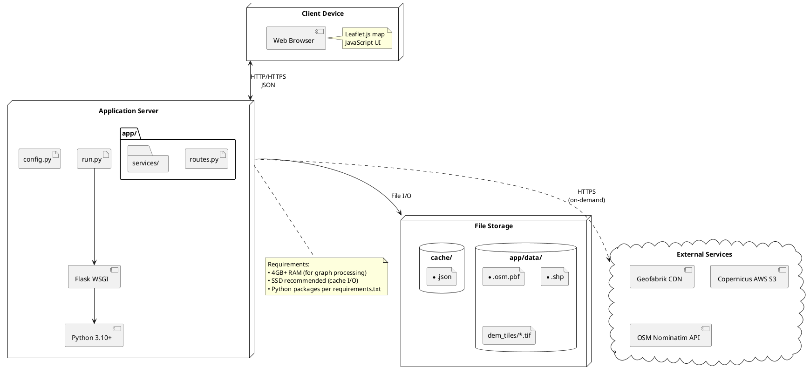

# Deployment Diagram

```plantuml
@startuml DeploymentDiagram
skinparam shadowing false
skinparam nodeStyle rectangle

node "Client Device" as Client {
    component [Web Browser] as Browser
    note right of Browser
      Leaflet.js map
      JavaScript UI
    end note
}

node "Application Server" as AppServer {
    component [Flask WSGI] as Flask
    component [Python 3.10+] as Python
    
    artifact "run.py" as RunPy
    artifact "config.py" as ConfigPy
    
    folder "app/" {
        artifact "routes.py"
        folder "services/"
    }
    
    Flask --> Python
    RunPy --> Flask
}

node "File Storage" as Storage {
    database "app/data/" as DataDir {
        file "*.osm.pbf" as PBF
        file "*.shp" as SHP
        file "dem_tiles/*.tif" as DEM
    }
    
    database "cache/" as CacheDir {
        file "*.json" as CacheJSON
    }
}

cloud "External Services" as External {
    [Geofabrik CDN] as Geofabrik
    [Copernicus AWS S3] as Copernicus
    [OSM Nominatim API] as Nominatim
}

Client <--> AppServer : HTTP/HTTPS\nJSON
AppServer --> Storage : File I/O
AppServer ..> External : HTTPS\n(on-demand)

note bottom of AppServer
  Requirements:
  • 4GB+ RAM (for graph processing)
  • SSD recommended (cache I/O)
  • Python packages per requirements.txt
end note

@enduml
```
