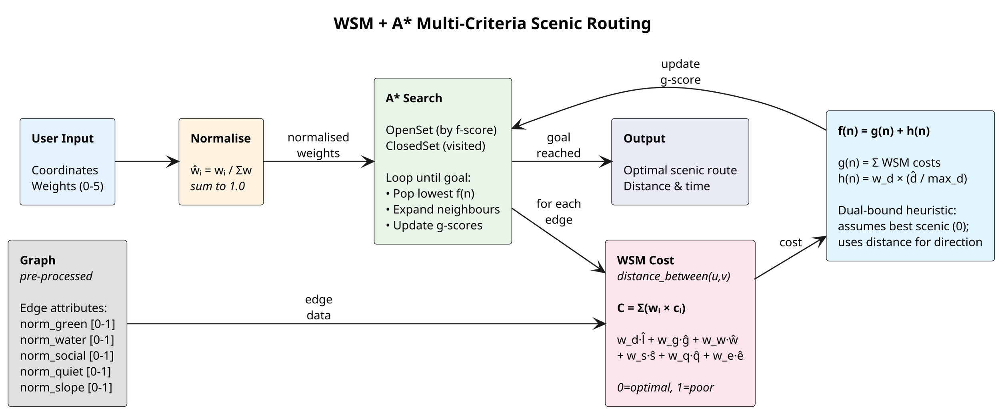

# WSM + A\* Scenic Routing Algorithm (Horizontal)

```plantuml
@startuml WSM_AStar_Algorithm_Horizontal
!define RESOLUTION 300
skinparam dpi 300
skinparam backgroundColor transparent
skinparam shadowing false
skinparam defaultFontName Arial
skinparam defaultFontSize 10
skinparam roundcorner 5
skinparam nodesep 30
skinparam ranksep 40

left to right direction

title <size:14><b>WSM + A* Multi-Criteria Scenic Routing</b></size>

' ===== INPUT STAGE (Left) =====
together {
  rectangle "**User Input**\n\nCoordinates\nWeights (0-5)" as INPUT #E3F2FD

  rectangle "**Graph**\n//pre-processed//\n\nEdge attributes:\nnorm_green [0-1]\nnorm_water [0-1]\nnorm_social [0-1]\nnorm_quiet [0-1]\nnorm_slope [0-1]" as GRAPH #E0E0E0
}

' ===== NORMALISE STAGE =====
rectangle "**Normalise**\n\nŵᵢ = wᵢ / Σw\n//sum to 1.0//" as NORM #FFF3E0

' ===== CORE ALGORITHM (Center) =====
rectangle "**A* Search**\n\nOpenSet (by f-score)\nClosedSet (visited)\n\nLoop until goal:\n• Pop lowest f(n)\n• Expand neighbours\n• Update g-scores" as ASTAR #E8F5E9

rectangle "**WSM Cost**\n//distance_between(u,v)//\n\n**C = Σ(wᵢ × cᵢ)**\n\nw_d·l̂ + w_g·ĝ + w_w·ŵ\n+ w_s·ŝ + w_q·q̂ + w_e·ê\n\n//0=optimal, 1=poor//" as WSM #FCE4EC

rectangle "**f(n) = g(n) + h(n)**\n\ng(n) = Σ WSM costs\nh(n) = w_d × (d̂ / max_d)\n\nDual-bound heuristic:\nassumes best scenic (0);\nuses distance for direction" as FSCORE #E1F5FE

' ===== OUTPUT STAGE (Right) =====
rectangle "**Output**\n\nOptimal scenic route\nDistance & time" as OUTPUT #E8EAF6

' ===== CONNECTIONS (Horizontal Flow) =====
INPUT --> NORM : " "
NORM --> ASTAR : normalised\nweights
GRAPH --> WSM : edge\ndata
ASTAR --> WSM : for each\nedge
WSM --> FSCORE : cost
FSCORE --> ASTAR : update\ng-score
ASTAR --> OUTPUT : goal\nreached

@enduml
```
