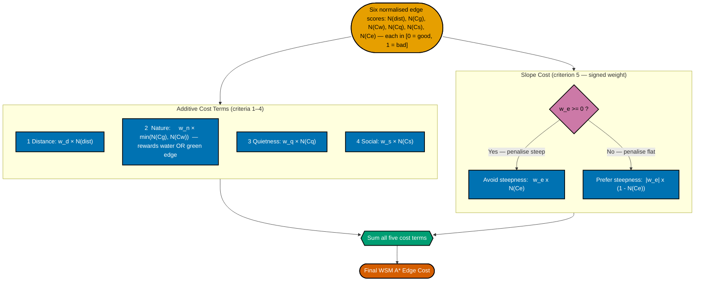

# 2. WSM Additive (with Group Nature) Mathematical Flow

**Section:** Cost Function / Algorithmic Implementation  
**Purpose:** Details how `cost_calculator.py` processes raw scenic factors into a final admissible WSM A\* edge cost. The system evaluates **six criteria**: distance, greenness, water, quietness, social, and slope. With the optional "Group Nature" toggle, greenness and water use a disjunctive `min()` operator to prevent multi-criteria collapse (an edge near water OR greenery is equally rewarded). The slope criterion has **signed semantics**: a positive weight penalises steepness while a negative weight penalises flatness (preferring hilly routes). Adheres to the Okabe-Ito colour palette; distinct shapes (stadium for data, trapezoid for weights, rectangles for functions, hexagons for logic operators) guarantee visual accessibility.

**Source:** [`cost_calculator.py` — `validate_weights()`](../../app/services/routing/cost_calculator.py#L48) enforces six required keys: `distance`, `greenness`, `water`, `quietness`, `social`, `slope`. [`cost_wsm_additive()`](../../app/services/routing/cost_calculator.py#L113) is the implementation.

