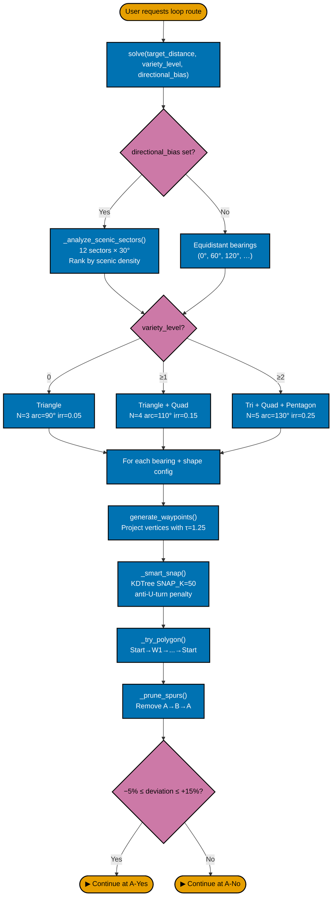
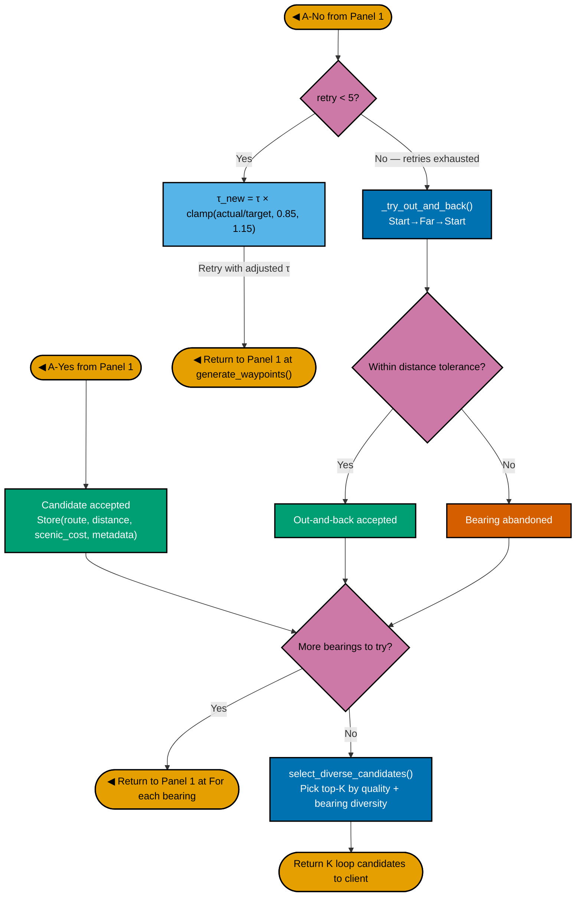

# 3A. Geometric Loop Solver — Split Two-Panel Continuation

**Goal:** Keep full detail while making the figure printable on a single A4 page by placing two connected panels side-by-side.

## Panel 1 (Left): Request → Distance Check

## Panel 2 (Right): Accept / Retry / Fallback / Return

## Placement Notes (for A4)

- Put Panel 1 on the left and Panel 2 on the right in equal-width columns.
- Keep both panels at the same visual scale.
- The `A-Yes` and `A-No` markers are continuation anchors and replace edge-cropping.
- If exported as SVG/PDF, text remains readable when printed.
