# 3B. Geometric Loop Solver — Compact Landscape (Single Diagram)

**Goal:** Compress height by converting to a left-to-right flow with shorter node labels for better A4 fit.

```mermaid
flowchart LR
    classDef entry fill:#E69F00,stroke:#000,stroke-width:2px,color:#000
    classDef process fill:#0072B2,stroke:#000,stroke-width:2px,color:#FFF
    classDef decision fill:#CC79A7,stroke:#000,stroke-width:2px,color:#000
    classDef success fill:#009E73,stroke:#000,stroke-width:2px,color:#FFF
    classDef fail fill:#D55E00,stroke:#000,stroke-width:2px,color:#FFF
    classDef feedback fill:#56B4E9,stroke:#000,stroke-width:2px,color:#000

    Start(["Request loop"]):::entry --> Solve["solve(target, variety, bias)"]:::process
    Solve --> Bias{"directional_bias?"}:::decision

    Bias -->|"Yes"| Scenic["Scenic-ranked bearings"]:::process
    Bias -->|"No"| Equi["Equidistant bearings"]:::process

    Scenic --> Var{"variety_level"}:::decision
    Equi --> Var

    Var -->|"0"| C0["Triangle"]:::process
    Var -->|"≥1"| C1["Triangle + Quad"]:::process
    Var -->|"≥2"| C2["Tri + Quad + Pentagon"]:::process

    C0 --> Loop["For each bearing+shape"]:::process
    C1 --> Loop
    C2 --> Loop

    Loop --> Gen["Generate waypoints (τ)"]:::process --> Snap["Smart snap (KDTree)"]:::process --> Poly["Try polygon route"]:::process --> Prune["Prune spurs"]:::process
    Prune --> Dist{"Within -5% / +15%?"}:::decision

    Dist -->|"Yes"| Accept["Accept candidate"]:::success --> Next{"More bearings?"}:::decision

    Dist -->|"No"| Retry{"retry < 5?"}:::decision
    Retry -->|"Yes"| Tau["Update τ with clamp"]:::feedback --> Gen

    Retry -->|"No"| OAB["Out-and-back fallback"]:::process --> OABDist{"Within tolerance?"}:::decision
    OABDist -->|"Yes"| OABAcc["Accept out-and-back"]:::success --> Next
    OABDist -->|"No"| OABRej["Abandon bearing"]:::fail --> Next

    Next -->|"Yes"| Loop
    Next -->|"No"| Select["Select top-K diverse candidates"]:::process --> Result(["Return K routes"]):::entry
```

## Detail Legend (kept outside nodes for readability)

- Scenic analysis: 12 sectors × 30° ranked by scenic density.
- Snap stage: `SNAP_K = 50`, anti-U-turn threshold 135°, `flow_penalty = 500.0`.
- Feedback loop: `MAX_FEEDBACK_RETRIES = 5`, `τ_new = τ × clamp(actual/target, 0.85, 1.15)`.
- Tolerance: `-5%` under, `+15%` over target distance.
