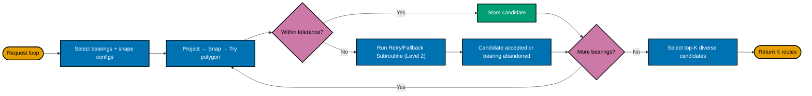
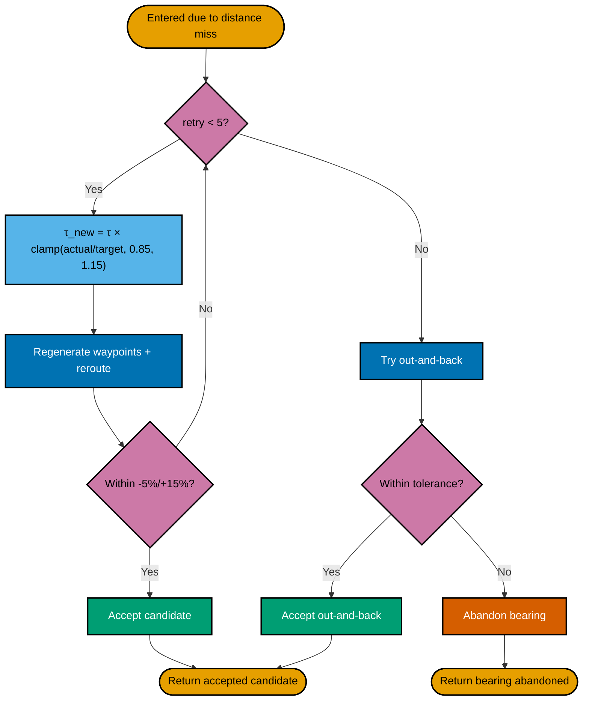

# 3C. Geometric Loop Solver — Two-Level Figure (Overview + Detail)

**Goal:** Keep the main figure compact and move dense retry logic into a focused second diagram.

## Level 1: Master Flow (Compact)

## Level 2: Retry + Out-and-Back Subroutine

## Notes

- This method is usually easiest to read at A4 because each figure has lower node count.
- Level 1 communicates full algorithm sequence; Level 2 preserves exact retry semantics.
