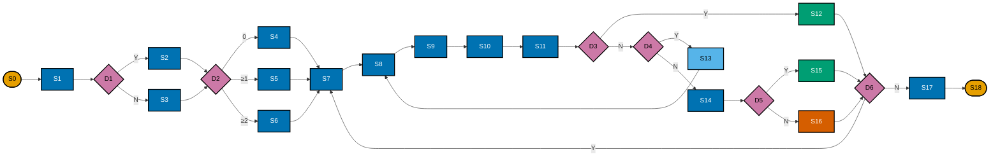

# 3D. Geometric Loop Solver — Step-Code + Legend (Maximum Compression)

**Goal:** Minimise text inside nodes for print legibility; keep full semantics in a legend table.

## Legend

| Code | Meaning |
|---|---|
| S0 | User requests loop route |
| S1 | `solve(target_distance, variety_level, directional_bias)` |
| D1 | directional bias set? |
| S2 | scenic sector bearing analysis |
| S3 | equidistant bearings |
| D2 | variety-level gate |
| S4 | configs: Triangle |
| S5 | configs: Triangle + Quad |
| S6 | configs: Tri + Quad + Pentagon |
| S7 | iterate bearing + shape config |
| S8 | generate waypoints (`τ` scale) |
| S9 | smart snap (`SNAP_K=50`, anti-U-turn penalty) |
| S10 | try polygon route |
| S11 | prune spurs + recalc distance |
| D3 | within tolerance (`-5%`, `+15%`)? |
| S12 | accept candidate |
| D4 | retries remaining (`<5`)? |
| S13 | update `τ`: `τ × clamp(actual/target, 0.85, 1.15)` |
| S14 | out-and-back fallback |
| D5 | out-and-back within tolerance? |
| S15 | accept out-and-back |
| S16 | abandon bearing |
| D6 | more bearings to try? |
| S17 | select top-K diverse candidates |
| S18 | return K loop candidates |

## Notes

- This is the densest printable form and often the easiest to fit into strict report templates.
- It trades immediate readability for compactness; use when page space is constrained.
