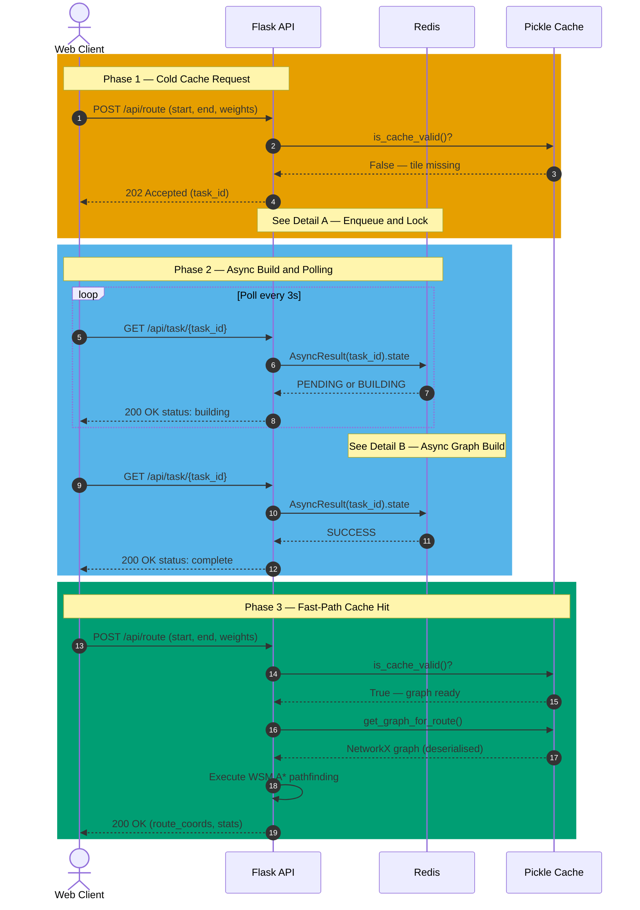
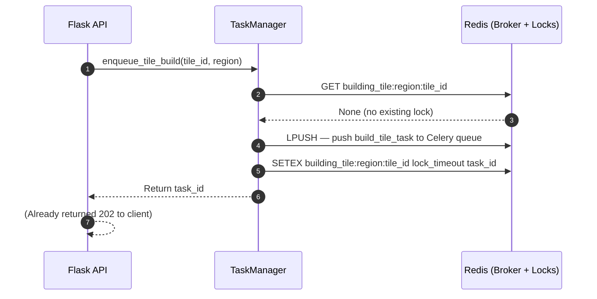
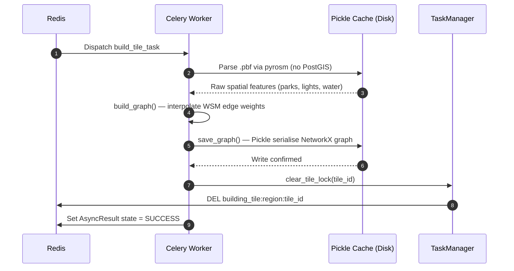

# Async Request Flow Sequence Diagram

This sequence diagram illustrates the decoupled architecture of the Scenic Pathfinding Engine. The full flow is split across three diagrams for A4 readability: this **overview** plus **Detail A** (Enqueue & Lock) and **Detail B** (Async Graph Build).

---

## Overview — Three-Phase Request Lifecycle

---

## Detail A — Enqueue and Redis Lock

Expands Phase 1, Steps 4–5. Shows how `TaskManager` prevents duplicate concurrent tile builds via a Redis `setex` lock (NFR-03).

> **Concurrency note (ADR-005):** If a second request arrives for the same tile while the lock exists, `GET building_tile:…` returns the existing `task_id`. No duplicate task is enqueued — all concurrent callers poll the same Celery job.

---

## Detail B — Async Graph Build

Expands Phase 2 background work. Shows the Celery worker parsing `.pbf`, building the graph, and releasing the Redis lock.

> **Decoupling rationale:** `build_graph()` takes 60–120 seconds for large regions. Offloading to Celery means the Flask API never blocks, achieving NFR-01 (warm-cache sub-2s) alongside NFR-02 (build under 120s).

---

## Architectural Justification

- **Decoupling:** The heavy `build_graph()` process (parsing OSM `.pbf` via `pyrosm`) can take over 60 seconds. Offloading to Celery means Flask never blocks or hits a gateway timeout.
- **Concurrency Control (ADR-005):** The `TaskManager` Redis lock guarantees NFR-03: 4 concurrent requests for the same uncached tile result in exactly 1 Celery task execution.
- **Polling:** The client polls actively (Phase 2), providing UI feedback rather than a frozen page.
- **Caching Strategy (ADR-007):** Phase 3 leverages the graph written by the worker. Flask immediately enters memory-bound A\* traversal, achieving the sub-2-second NFR-01 goal.
