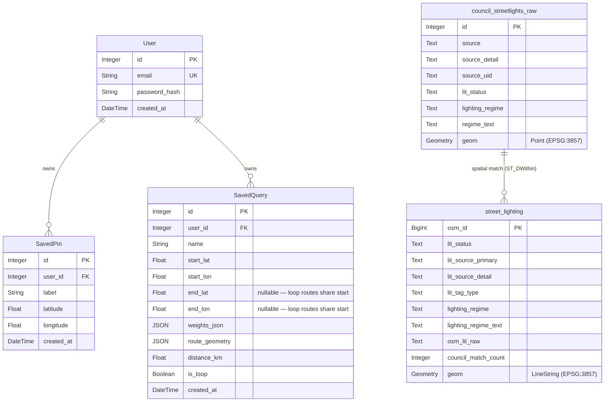

# Entity-Relationship Diagram (ERD)

This diagram illustrates the dual-database architecture of the Scenic Pathfinding Engine. It highlights the strict boundary between the `user_db` (managed by SQLAlchemy and Alembic) and the `spatial_db` (managed by PostGIS overlay tables seeded from OSM/council sources).

## Architectural Justification (Dual-Schema Segregation)

As detailed in **ADR-012**, the architecture deliberately physically segregates the User Database from the Spatial Database.

Notice in the ERD that there are **no foreign key relationships** crossing between the tables.

- **The `user_db`** is entirely stateless geographically. A `SavedPin` stores raw `Float` coordinates rather than heavy PostGIS `Geometry` types. It is strictly tied to the Flask application layer and managed gracefully via Flask-Migrate (Alembic) schema migrations.
- **The `spatial_db`** is volatile and exists purely for visual rendering. Seeder jobs can rebuild `street_lighting`, reload/update `council_streetlights_raw`, and refresh tile SQL functions without affecting user accounts. If user data was co-located, routine map-overlay refreshes could wipe account data.

Because of this strict segregation, the Flask Python backend **never queries PostGIS directly**. Instead:

1.  **Graph Building (Offline Routing):** Celery workers natively parse local `.pbf` files into memory using `pyrosm`, then enrich edges with council streetlight points before writing cached graphs.
2.  **Visual Overlays (Frontend):** The `spatial_db` (PostGIS) is exclusively queried by the containerised **Martin** tileserver, which streams Mapbox Vector Tiles (MVT) from `street_lighting` via `street_lighting_filtered(...)`.

**Why is there no strict FK between council points and street segments?**
The merge between `council_streetlights_raw` and `street_lighting` is spatial (`ST_DWithin`) rather than identity-based. A council point can match multiple nearby segments and many segments may have no council match. Provenance and match quality are preserved directly in `street_lighting` columns (`lit_source_primary`, `lit_source_detail`, `council_match_count`) instead of rigid relational foreign keys.

This extreme decoupling ensures the pathfinding logic remains completely independent from the visual rendering pipeline, preventing complex SQL joins and avoiding ORM mapping overheads for billions of OSM nodes.
