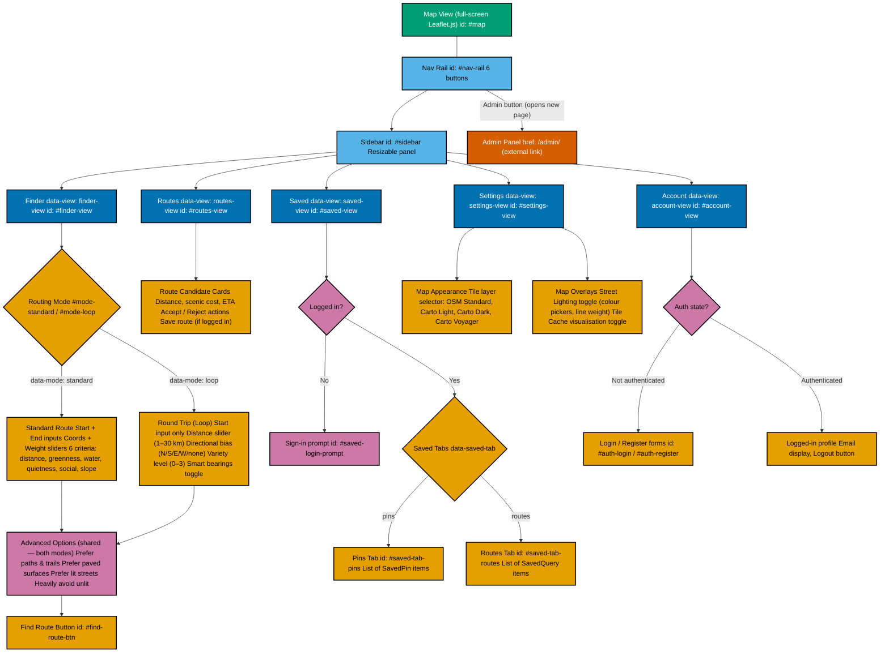

# 7. UI Page / Panel Flow — Mermaid Reference Source

> **Note:** This diagram is a **reference artefact** for the author's manual wireframe production. It is not the final report figure — it provides an accurate structural map of the single-page UI navigation to review against the live application before producing the polished wireframe manually.

**Source:** [`app/templates/index.html`](../../app/templates/index.html)  
**Nav-rail buttons:** Lines [53–77](../../app/templates/index.html#L53)  
**View panels:** `finder-view` ([L88](../../app/templates/index.html#L88)), `routes-view` ([L497](../../app/templates/index.html#L497)), `saved-view` ([L570](../../app/templates/index.html#L570)), `settings-view` ([L648](../../app/templates/index.html#L648)), `account-view` ([L855](../../app/templates/index.html#L855))

## Cross-Reference: `data-view` IDs

| Nav Button | `data-view`           | Panel `id`         | HTML Line |
| ---------- | --------------------- | ------------------ | --------- |
| Finder     | `finder-view`         | `#finder-view`     | L88       |
| Routes     | `routes-view`         | `#routes-view`     | L497      |
| Saved      | `saved-view`          | `#saved-view`      | L570      |
| Settings   | `settings-view`       | `#settings-view`   | L648      |
| Account    | `account-view`        | `#account-view`    | L855      |
| Admin      | _(none — `<a href>`)_ | External `/admin/` | L76       |
