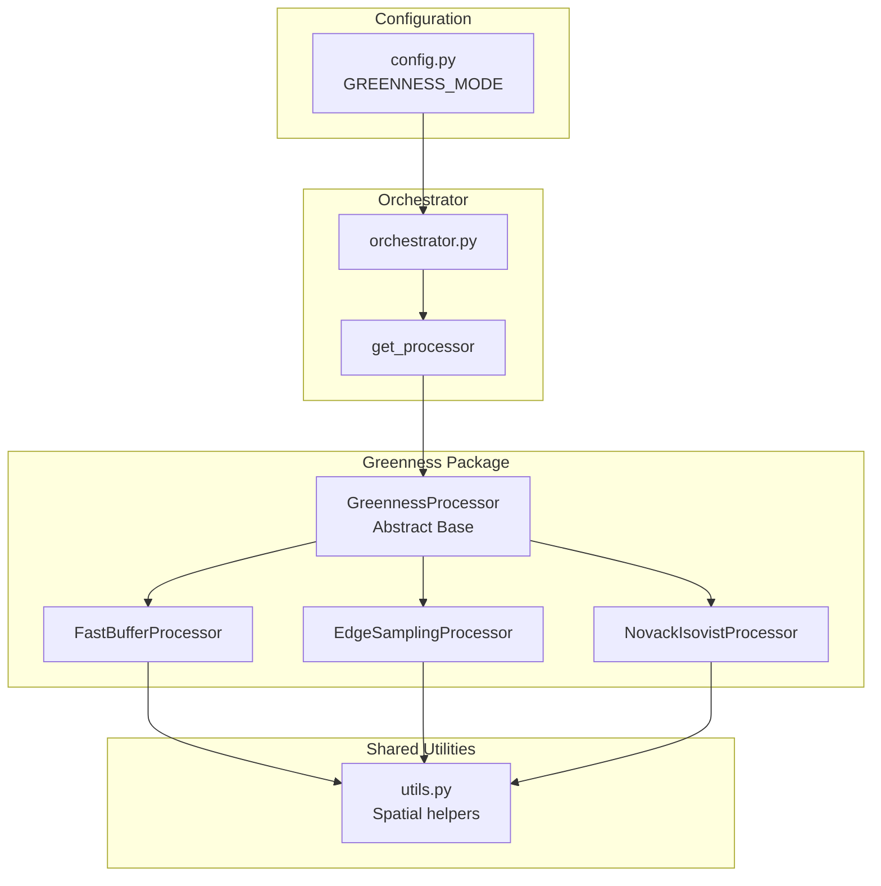

# Greenness Processing Architecture

This document describes the architecture of the greenness processing system,
which calculates how "green" each path segment is based on proximity to parks,
gardens, and other green spaces.

## Strategy Pattern Architecture

The greenness system uses the **Strategy Pattern** to allow easy switching
between different calculation methods via configuration.



## Available Modes

Set the mode in `config.py`:

```python
GREENNESS_MODE = 'EDGE_SAMPLING'  # Options: OFF, FAST, EDGE_SAMPLING, NOVACK
```

| Mode              | Speed   | Accuracy | Description                     |
| ----------------- | ------- | -------- | ------------------------------- |
| **OFF**           | Instant | N/A      | Skip greenness processing       |
| **FAST**          | ~30s    | ⭐⭐     | Point buffer at edge midpoint   |
| **EDGE_SAMPLING** | ~60s    | ⭐⭐⭐   | Multi-point sampling along edge |
| **NOVACK**        | ~10min  | ⭐⭐⭐⭐ | Full isovist ray-casting        |

## Package Structure

```
app/services/processors/greenness/
├── __init__.py          # Factory function and public API
├── base.py              # Abstract base class
├── utils.py             # Shared spatial utilities
├── fast_buffer.py       # FAST mode implementation
├── edge_sampling.py     # EDGE_SAMPLING mode implementation
└── novack_isovist.py    # NOVACK mode implementation
```

## Usage Examples

### Basic Usage (via orchestrator)

The orchestrator automatically uses the configured mode:

```python
from app.services.processors.orchestrator import process_scenic_attributes

graph = process_scenic_attributes(graph, loader, timings)
```

### Direct Factory Usage

```python
from app.services.processors.greenness import get_processor

# Get processor by mode name
processor = get_processor('EDGE_SAMPLING')

# Process graph
graph = processor.process(graph, green_gdf)
```

### Custom Parameters

```python
from app.services.processors.greenness import EdgeSamplingProcessor

# Create with custom settings
processor = EdgeSamplingProcessor(
    buffer_radius=40.0,    # metres around each sample
    sample_interval=15.0   # metres between samples
)

graph = processor.process(graph, green_gdf)
```

## Adding New Processors

To add a new greenness calculation method:

1. Create a new file in `greenness/` (e.g., `my_method.py`)
2. Implement the `GreennessProcessor` base class
3. Register in `__init__.py`

```python
# greenness/my_method.py
from .base import GreennessProcessor

class MyMethodProcessor(GreennessProcessor):
    @property
    def name(self) -> str:
        return "My Method"

    def process(self, graph, green_gdf, **kwargs):
        self.validate_graph(graph)
        # Add raw_green_cost to each edge
        for u, v, key, data in graph.edges(keys=True, data=True):
            data['raw_green_cost'] = self._calculate(...)
        return graph
```

```python
# app\__init__.py (add to registry)
from .my_method import MyMethodProcessor

_PROCESSOR_REGISTRY['MY_METHOD'] = MyMethodProcessor
```

## Edge Attribute

All processors add the same attribute to graph edges:

| Attribute        | Type  | Range     | Meaning                          |
| ---------------- | ----- | --------- | -------------------------------- |
| `raw_green_cost` | float | 0.0 - 1.0 | 0.0 = very green, 1.0 = no green |

This value is later normalised to `norm_green` by the normalisation processor,
then used in the WSM cost calculation during routing.
