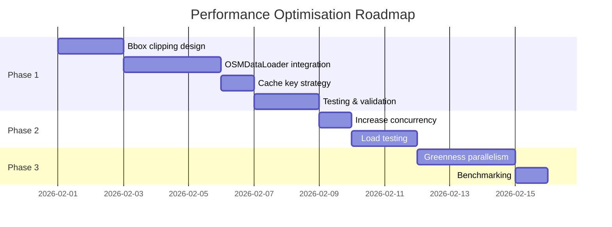

# Performance Optimisation Strategy

> **Status**: Planning Document  
> **Author**: Senior Engineering Review  
> **Focus**: Memory-efficient parallelism for graph processing

---

## 1. Problem Statement

Graph building for large regions (e.g., Somerset: 1.1M nodes, 2.3M edges) exhibits:

| Metric | Current Value | Target |
|--------|---------------|--------|
| Build time | ~15 minutes | <2 minutes |
| Cache load time | ~54 seconds | <5 seconds |
| Memory usage | 12-14 GB | <4 GB |
| Worker concurrency | 1 | 2-4 |

**Key insight**: Memory is the primary bottleneck, not CPU. Adding workers without addressing memory will cause OOM failures.

---

## 2. Root Cause Analysis

### 2.1 Memory Consumption Breakdown

| Stage | Memory Impact | Cause |
|-------|---------------|-------|
| PBF parsing | ~4 GB | Entire county loaded into pyrosm |
| NetworkX graph | ~6 GB | 2.3M edges with 10+ attributes each |
| Scenic scoring | ~2 GB | Shapely STRtree for spatial queries |
| Pickle cache | ~2 GB on disk | Full graph serialised |
| **Total peak** | **~12-14 GB** | |

### 2.2 Why Simple Parallelism Won't Work

```
Current: 1 worker × 12 GB = 12 GB required
Naive:   2 workers × 12 GB = 24 GB required ❌
Goal:    4 workers × 3 GB = 12 GB required ✅
```

**Prerequisite**: Reduce per-task memory to ~3 GB before scaling workers.

---

## 3. Recommended Strategy: Phased Approach

### Phase 1: Bounding Box Clipping (Priority: Critical)

**Objective**: Only load graph data within the route's bounding box + buffer.

**Implementation**:
```python
# Current (loads entire county)
osm = OSM(pbf_path)
nodes, edges = osm.get_network(network_type="walking")

# Proposed (clips to bbox)
osm = OSM(pbf_path, bounding_box=[min_lon, min_lat, max_lon, max_lat])
nodes, edges = osm.get_network(network_type="walking")
```

**Expected impact**:

| Metric | Before | After |
|--------|--------|-------|
| Nodes loaded (Bath route) | 1,114,246 | ~50,000 |
| Memory usage | 12 GB | ~500 MB |
| Build time | 15 min | ~45 sec |
| Cache load time | 54 sec | ~2 sec |

**Trade-offs**:
- Cache key must include bbox hash (more cache entries)
- Very long routes may need larger clips

---

### Phase 2: Increase Worker Concurrency

**Prerequisite**: Phase 1 complete (memory per task < 2 GB).

**Implementation**:
```yaml
# docker-compose.yml
worker:
  command: celery -A celery_app worker --concurrency=4
```

**Benefit**: 4 different regions can build simultaneously.

---

### Phase 3: Within-Task Parallelism (Optional)

Parallelise independent processing stages within a single graph build.

**Parallelisable stages**:

| Stage | Method | Speedup |
|-------|--------|---------|
| Greenness scoring | ProcessPoolExecutor (edge batches) | 2-4× |
| Water proximity | ProcessPoolExecutor (edge batches) | 2-4× |
| Normalisation | NumPy vectorisation (already fast) | Minimal |

**Implementation sketch**:
```python
from concurrent.futures import ProcessPoolExecutor

def score_greenness_batch(edges_batch, green_index):
    """Score a batch of edges for greenness."""
    results = {}
    for u, v, data in edges_batch:
        results[(u, v)] = calculate_greenness(data, green_index)
    return results

def parallel_greenness(graph, green_index, n_workers=4):
    edges = list(graph.edges(data=True))
    batch_size = len(edges) // n_workers
    batches = [edges[i:i+batch_size] for i in range(0, len(edges), batch_size)]
    
    with ProcessPoolExecutor(max_workers=n_workers) as executor:
        futures = [executor.submit(score_greenness_batch, batch, green_index) 
                   for batch in batches]
        for future in futures:
            results = future.result()
            # Merge results back into graph
```

**Caution**: Inter-process communication overhead may negate gains for small graphs.

---

## 4. Decision Matrix

| Enhancement | Impact | Effort | Memory Reduction | Recommendation |
|-------------|--------|--------|------------------|----------------|
| Bbox clipping | High | Medium | ~95% | **Do first** |
| Worker concurrency | Medium | Low | 0% (enables scaling) | After Phase 1 |
| Within-task parallelism | Low-Medium | High | 0% | Optional |
| Graph database (Neo4j) | High | Very High | 100% (disk-based) | Not recommended |

---

## 5. Implementation Roadmap



---

## 6. Code Changes Required

### Phase 1: Bbox Clipping

| File | Changes |
|------|---------|
| `OSMDataLoader.fetch_data()` | Accept bbox parameter, pass to pyrosm |
| `GraphBuilder.build_graph()` | Clip graph to bbox after loading |
| `CacheManager._get_cache_key()` | Include bbox hash in cache key |
| `routes.py` | Compute appropriate bbox + buffer |

### Phase 2: Worker Concurrency

| File | Changes |
|------|---------|
| `docker-compose.yml` | Change `--concurrency=1` to `--concurrency=4` |
| Docker Desktop | Increase memory allocation |

---

## 7. Risks and Mitigations

| Risk | Likelihood | Impact | Mitigation |
|------|------------|--------|------------|
| Bbox too small (route fails) | Medium | High | Use generous buffer (5+ km) |
| Cache fragmentation | Low | Medium | Implement cache eviction policy |
| Memory spikes during parallel scoring | Medium | Medium | Add memory guards in workers |

---

## 8. Success Metrics

| Metric | Current | Phase 1 Target | Phase 2 Target |
|--------|---------|----------------|----------------|
| Avg build time (5km route) | 15 min | 45 sec | 45 sec |
| Cache load time | 54 sec | 2 sec | 2 sec |
| Concurrent builds | 1 | 1 | 4 |
| Memory per build | 12 GB | 500 MB | 500 MB |
