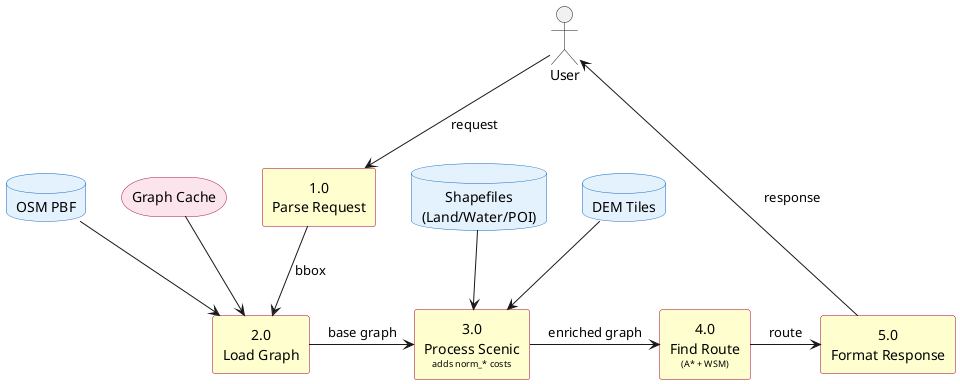

# Data Flow Diagram

```plantuml
@startuml DataFlowDiagram
skinparam shadowing false
skinparam defaultTextAlignment center

' Define styles
skinparam rectangle {
    BackgroundColor #FEFECE
    BorderColor #A80036
}

skinparam database {
    BackgroundColor #E3F2FD
    BorderColor #1565C0
}

skinparam storage {
    BackgroundColor #FCE4EC
    BorderColor #AD1457
}

' External entities
actor "User" as User

' Data stores (top row)
database "OSM PBF" as OSMPBF
storage "Graph Cache" as GraphCache
database "Shapefiles\n(Land/Water/POI)" as SHP
database "DEM Tiles" as DEMTiles

' Processes (bottom row, left to right)
rectangle "1.0\nParse Request" as P1
rectangle "2.0\nLoad Graph" as P2
rectangle "3.0\nProcess Scenic\n<size:9>adds norm_* costs</size>" as P3
rectangle "4.0\nFind Route\n<size:9>(A* + WSM)</size>" as P4
rectangle "5.0\nFormat Response" as P5

' Layout hints - force horizontal process alignment
P1 -[hidden]right-> P2
P2 -[hidden]right-> P3
P3 -[hidden]right-> P4
P4 -[hidden]right-> P5

' Data stores to processes (vertical, clean)
OSMPBF -down-> P2
GraphCache -down-> P2
SHP -down-> P3
DEMTiles -down-> P3

' Process flow
User -down-> P1 : request
P1 -down-> P2 : bbox
P2 -right-> P3 : base graph
P3 -right-> P4 : enriched graph
P4 -right-> P5 : route
P5 -up-> User : response

@enduml
```
