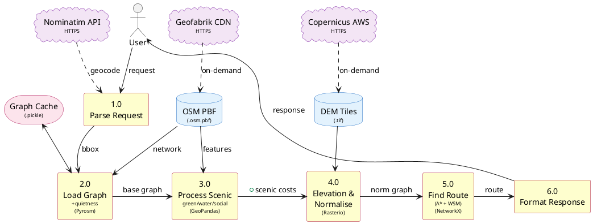

# Data Flow Diagram

```plantuml
@startuml DataFlowDiagram
skinparam shadowing false
skinparam defaultTextAlignment center

' Define styles
skinparam rectangle {
    BackgroundColor #FEFECE
    BorderColor #A80036
}

skinparam database {
    BackgroundColor #E3F2FD
    BorderColor #1565C0
}

skinparam storage {
    BackgroundColor #FCE4EC
    BorderColor #AD1457
}

skinparam cloud {
    BackgroundColor #F3E5F5
    BorderColor #7B1FA2
}

' External entities
actor "User" as User

' External services (top)
cloud "Geofabrik CDN\n<size:9>HTTPS</size>" as Geofabrik
cloud "Copernicus AWS\n<size:9>HTTPS</size>" as Copernicus
cloud "Nominatim API\n<size:9>HTTPS</size>" as Nominatim

' Local data stores
database "OSM PBF\n<size:9>(.osm.pbf)</size>" as OSMPBF
database "DEM Tiles\n<size:9>(.tif)</size>" as DEMTiles
storage "Graph Cache\n<size:9>(.pickle)</size>" as GraphCache

' Processes (bottom row, left to right)
rectangle "1.0\nParse Request" as P1
rectangle "2.0\nLoad Graph\n<size:9>+quietness</size>\n<size:9>(Pyrosm)</size>" as P2
rectangle "3.0\nProcess Scenic\n<size:9>green/water/social</size>\n<size:9>(GeoPandas)</size>" as P3
rectangle "4.0\nElevation &\nNormalise\n<size:9>(Rasterio)</size>" as P4
rectangle "5.0\nFind Route\n<size:9>(A* + WSM)</size>\n<size:9>(NetworkX)</size>" as P5
rectangle "6.0\nFormat Response" as P6

' Layout - processes in a row
P1 -[hidden]right-> P2
P2 -[hidden]right-> P3
P3 -[hidden]right-> P4
P4 -[hidden]right-> P5
P5 -[hidden]right-> P6

' External to local data (on-demand download)
Geofabrik ..> OSMPBF : on-demand
Copernicus ..> DEMTiles : on-demand
Nominatim ..> P1 : geocode

' Local data to processes
OSMPBF -down-> P2 : network
OSMPBF -down-> P3 : features
GraphCache <-down-> P2
DEMTiles -down-> P4

' Process flow
User -down-> P1 : request
P1 -down-> P2 : bbox
P2 -right-> P3 : base graph
P3 -right-> P4 : +scenic costs
P4 -right-> P5 : norm graph
P5 -right-> P6 : route
P6 -up-> User : response

@enduml
```
