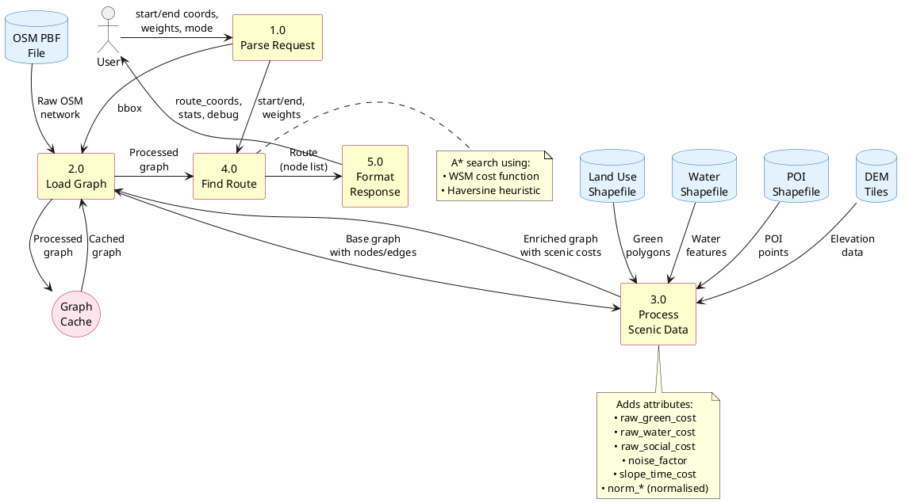

# Data Flow Diagram

```plantuml
@startuml DataFlowDiagram
skinparam shadowing false
skinparam defaultTextAlignment center

' Define styles
skinparam rectangle {
    BackgroundColor #FEFECE
    BorderColor #A80036
}

skinparam database {
    BackgroundColor #E3F2FD
    BorderColor #1565C0
}

skinparam storage {
    BackgroundColor #FCE4EC
    BorderColor #AD1457
}

' External entities
actor "User" as User

' Data stores
database "OSM PBF\nFile" as OSMPBF
database "Land Use\nShapefile" as LandUseSHP
database "Water\nShapefile" as WaterSHP
database "POI\nShapefile" as POISSHP
database "DEM\nTiles" as DEMTiles
storage "Graph\nCache" as GraphCache

' Processes
rectangle "1.0\nParse Request" as P1
rectangle "2.0\nLoad Graph" as P2
rectangle "3.0\nProcess\nScenic Data" as P3
rectangle "4.0\nFind Route" as P4
rectangle "5.0\nFormat\nResponse" as P5

' Data flows
User -right-> P1 : start/end coords,\nweights, mode
P1 -down-> P2 : bbox

OSMPBF --> P2 : Raw OSM\nnetwork
P2 --> GraphCache : Processed\ngraph

GraphCache --> P2 : Cached\ngraph

LandUseSHP --> P3 : Green\npolygons
WaterSHP --> P3 : Water\nfeatures
POISSHP --> P3 : POI\npoints
DEMTiles --> P3 : Elevation\ndata

P2 --> P3 : Base graph\nwith nodes/edges
P3 --> P2 : Enriched graph\nwith scenic costs

P2 -right-> P4 : Processed\ngraph
P1 -right-> P4 : start/end,\nweights

P4 -right-> P5 : Route\n(node list)
P5 --> User : route_coords,\nstats, debug

note bottom of P3
  Adds attributes:
  • raw_green_cost
  • raw_water_cost
  • raw_social_cost
  • noise_factor
  • slope_time_cost
  • norm_* (normalised)
end note

note right of P4
  A* search using:
  • WSM cost function
  • Haversine heuristic
end note

@enduml
```
