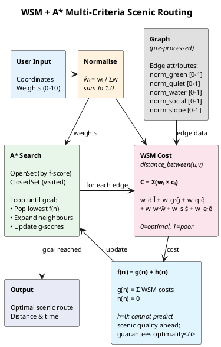

# WSM + A\* Scenic Routing Algorithm

```plantuml
@startuml WSM_AStar_Algorithm
skinparam backgroundColor white
skinparam shadowing false
skinparam defaultFontName Arial
skinparam defaultFontSize 11
skinparam roundcorner 5
skinparam nodesep 20
skinparam ranksep 25

title <size:15><b>WSM + A* Multi-Criteria Scenic Routing</b></size>

' ===== TOP ROW =====
rectangle "**Graph**\n<i>(pre-processed)</i>\n\nEdge attributes:\nnorm_green [0-1]\nnorm_quiet [0-1]\nnorm_water [0-1]\nnorm_social [0-1]\nnorm_slope [0-1]" as GRAPH #E0E0E0

rectangle "**User Input**\n\nCoordinates\nWeights (0-10)" as INPUT #E3F2FD

rectangle "**Normalise**\n\nŵᵢ = wᵢ / Σw\n<i>sum to 1.0</i>" as NORM #FFF3E0

' ===== MIDDLE ROW =====
rectangle "**A* Search**\n\nOpenSet (by f-score)\nClosedSet (visited)\n\nLoop until goal:\n• Pop lowest f(n)\n• Expand neighbours\n• Update g-scores" as ASTAR #E8F5E9

rectangle "**WSM Cost**\n<i>distance_between(u,v)</i>\n\n<b>C = Σ(wᵢ × cᵢ)</b>\n\nw_d·l̂ + w_g·ĝ + w_q·q̂\n+ w_w·ŵ + w_s·ŝ + w_e·ê\n\n<i>0=optimal, 1=poor</i>" as WSM #FCE4EC

rectangle "**f(n) = g(n) + h(n)**\n\ng(n) = Σ WSM costs\nh(n) = 0\n\n<i>h=0: cannot predict\nscenic quality ahead;\nguarantees optimality</i>" as FSCORE #E1F5FE

' ===== BOTTOM =====
rectangle "**Output**\n\nOptimal scenic route\nDistance & time" as OUTPUT #E8EAF6

' ===== CONNECTIONS =====
GRAPH -down-> WSM : edge data
INPUT -right-> NORM
NORM -down-> ASTAR : weights
NORM -down-> WSM
ASTAR -right-> WSM : for each edge
WSM -right-> FSCORE : cost
FSCORE -up-> ASTAR : update
ASTAR -down-> OUTPUT : goal reached

@enduml
```
