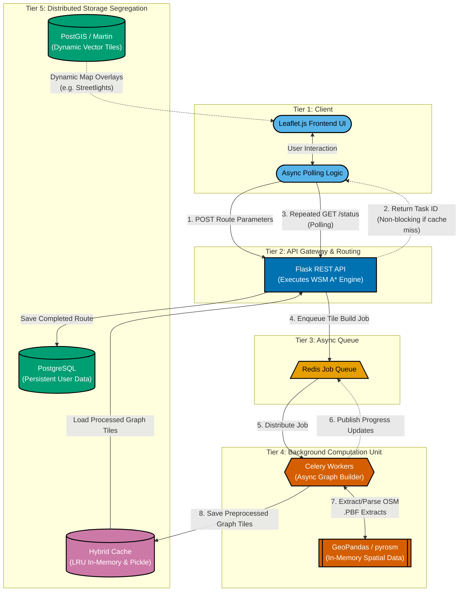

# 1. Asynchronous Architecture Data Flow 

**Section:** High-Level System Architecture
**Purpose:** Visualises the decoupled nature of the client, the API gateway, the Redis broker, and the Celery workers, alongside dual-database segregation. Uses Okabe-Ito colour palette and distinct shapes per tier for accessibility.

