# 3. Geometric Loop Solver — `solve()` Execution Flow

**Section:** The Geometric Loop Solver  
**Purpose:** Illustrates the full execution path of `GeometricLoopSolver.solve()`, showing how the solver constructs round-trip routes by projecting rigid geometric skeletons (Triangle, Quad, Pentagon) from a start node, adjusting via clamped proportional τ feedback, and falling back to an out-and-back route when all polygon attempts fail.

**Primary Source:** [`geometric_solver.py`](../../app/services/routing/loop_solvers/geometric_solver.py)  
**Constants:**

- `DEFAULT_TAU = 1.25` — initial tortuosity factor ([line 47](../../app/services/routing/loop_solvers/geometric_solver.py#L47))
- `MAX_FEEDBACK_RETRIES = 5` — max τ adjustment attempts per shape ([line 50](../../app/services/routing/loop_solvers/geometric_solver.py#L50))
- `TAU_CLAMP_LOW = 0.85`, `TAU_CLAMP_HIGH = 1.15` — clamp bounds per iteration ([lines 53–54](../../app/services/routing/loop_solvers/geometric_solver.py#L53))
- `TOLERANCE_UNDER = 0.05` (−5%), `TOLERANCE_OVER = 0.15` (+15%) — asymmetric distance tolerance ([lines 57–58](../../app/services/routing/loop_solvers/geometric_solver.py#L57))
- Shape configs gated by `variety_level` ([lines ~1144–1155](../../app/services/routing/loop_solvers/geometric_solver.py#L1144)):
  - `variety_level = 0`: **Triangle** (N=3, arc=90°, irregularity=0.05)
  - `variety_level ≥ 1`: adds **Quad** (N=4, arc=110°, irregularity=0.15)
  - `variety_level ≥ 2`: adds **Pentagon** (N=5, arc=130°, irregularity=0.25)
- `variety_level` API parameter: [`routes.py` line 228](../../app/routes.py#L228)

```mermaid
flowchart TD
    classDef entry fill:#E69F00,stroke:#000,stroke-width:2px,color:#000
    classDef process fill:#0072B2,stroke:#000,stroke-width:2px,color:#FFF
    classDef decision fill:#CC79A7,stroke:#000,stroke-width:2px,color:#000
    classDef success fill:#009E73,stroke:#000,stroke-width:2px,color:#FFF
    classDef fail fill:#D55E00,stroke:#000,stroke-width:2px,color:#FFF
    classDef feedback fill:#56B4E9,stroke:#000,stroke-width:2px,color:#000

    %% ── Entry ────────────────────────────────────────────────────
    Start(["User requests loop route"]):::entry
    Solve["solve(target_distance,\nvariety_level, directional_bias)"]:::process
    Start --> Solve

    %% ── Bearing Selection ────────────────────────────────────────
    BearingCheck{"directional_bias\nset?"}:::decision
    Solve --> BearingCheck

    SmartBearings["_analyze_scenic_sectors()\n12 sectors × 30° slices\nRank by scenic density"]:::process
    EquiBearings["Equidistant bearings\n(0°, 60°, 120°, …)"]:::process
    BearingCheck -->|"Yes"| SmartBearings
    BearingCheck -->|"No"| EquiBearings

    %% ── Shape Config Gate ────────────────────────────────────────
    ConfigGate{"variety_level?"}:::decision
    SmartBearings --> ConfigGate
    EquiBearings --> ConfigGate

    V0["configs = Triangle (N=3)\narc=90° irr=0.05"]:::process
    V1["configs = Triangle + Quad (N=4)\narc=110° irr=0.15"]:::process
    V2["configs = Tri + Quad + Pentagon (N=5)\narc=130° irr=0.25"]:::process

    ConfigGate -->|"0"| V0
    ConfigGate -->|"≥ 1"| V1
    ConfigGate -->|"≥ 2"| V2

    %% ── Per-Bearing Loop ─────────────────────────────────────────
    ForBearing["For each bearing\n& shape config"]:::process
    V0 --> ForBearing
    V1 --> ForBearing
    V2 --> ForBearing

    %% ── Waypoint Projection & Snap ──────────────────────────────
    GenWP["generate_waypoints()\nProject N vertices on skeleton\nτ = DEFAULT_TAU (1.25)"]:::process
    ForBearing --> GenWP

    Snap["_smart_snap()\nKDTree nearest SNAP_K=50 nodes\n135° anti-U-turn penalty\n(flow_penalty = 500.0)"]:::process
    GenWP --> Snap

    %% ── Try Polygon ──────────────────────────────────────────────
    TryPoly["_try_polygon(N vertices)\nRoute: Start→W1→W2→…→Start\nCritical-leg-first ordering"]:::process
    Snap --> TryPoly

    %% ── Prune & Measure ──────────────────────────────────────────
    Prune["_prune_spurs()\nRemove A→B→A artifacts\nRecalculate distance"]:::process
    TryPoly --> Prune

    %% ── Distance Check ───────────────────────────────────────────
    DistCheck{"−5% ≤ deviation ≤ +15%?"}:::decision
    Prune --> DistCheck

    Accept["Candidate accepted\nStore (route, distance,\nscenic_cost, metadata)"]:::success
    DistCheck -->|"Yes"| Accept

    %% ── τ Feedback Loop ──────────────────────────────────────────
    RetryCheck{"retry < 5\n(MAX_FEEDBACK_RETRIES)?"}:::decision
    DistCheck -->|"No"| RetryCheck

    TauUpdate["τ_new = τ × clamp(\nactual / target,\n0.85, 1.15)"]:::feedback
    RetryCheck -->|"Yes"| TauUpdate
    TauUpdate -->|"Retry with adjusted τ"| GenWP

    %% ── All Polygon Attempts Failed ──────────────────────────────
    OABFallback["_try_out_and_back()\nSingle waypoint at bearing\nRoute: Start→Far→Start"]:::process
    RetryCheck -->|"No — all retries exhausted"| OABFallback

    OABCheck{"Within distance\ntolerance?"}:::decision
    OABFallback --> OABCheck

    OABAccept["Out-and-back accepted"]:::success
    OABReject["Bearing abandoned"]:::fail
    OABCheck -->|"Yes"| OABAccept
    OABCheck -->|"No"| OABReject

    %% ── Next Bearing ────────────────────────────────────────────
    NextBearing{"More bearings\nto try?"}:::decision
    Accept --> NextBearing
    OABAccept --> NextBearing
    OABReject --> NextBearing

    NextBearing -->|"Yes"| ForBearing

    %% ── Final Selection ──────────────────────────────────────────
    SelectDiv["select_diverse_candidates()\nPick top-K by quality_score\nMaximise bearing diversity"]:::process
    NextBearing -->|"No"| SelectDiv

    Result(["Return K loop candidates\nto client"]):::entry
    SelectDiv --> Result
```

## Key Algorithm Details

### Anti-U-Turn Penalty (`_smart_snap`)

When snapping projected waypoints to real graph nodes, the solver calculates the bearing from the previous waypoint. If the candidate snap node would require a turn > 135° (i.e., nearly reversing direction), a `flow_penalty = 500.0` is added to its selection score. This forces continuous forward movement and prevents degenerate "U-turn" loops.

### Clamped τ Proportional Feedback

The tortuosity factor τ controls how large the geometric skeleton is relative to the target distance. After each polygon attempt, if the routed distance is outside tolerance, τ is updated:

$$\tau_{\text{new}} = \tau \times \text{clamp}\!\left(\frac{d_{\text{actual}}}{d_{\text{target}}},\ 0.85,\ 1.15\right)$$

The clamp prevents runaway oscillations — τ can only change by ±15% per iteration, and the system gets up to 5 retries (`MAX_FEEDBACK_RETRIES`).

### Asymmetric Tolerance

Runners and walkers prefer routes that are slightly longer than the target over routes that are too short. The solver uses **asymmetric tolerance**: routes may be up to 15% over target but only 5% under.
