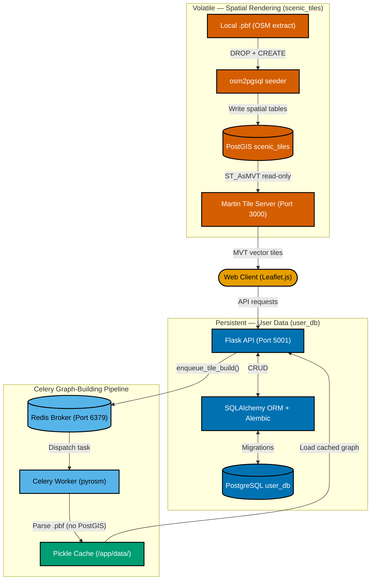

# 4. Dual-Database Segregation Boundary

**Section:** High-Level System Architecture  
**Purpose:** Illustrates the strict physical separation between the **volatile spatial database** (PostGIS / `scenic_tiles`) and the **persistent user database** (PostgreSQL / `user_db`). No data flows cross the boundary. The Celery graph-building pipeline bypasses PostGIS entirely, using `pyrosm` to parse local `.pbf` files directly.

**Sources:**

- [`docker-compose.yml`](../../docker-compose.yml) — service definitions: `db` (PostGIS), `tileserver` (Martin), `seeder` (osm2pgsql), `api` (Flask), `worker` (Celery), `redis`
- [`config.py`](../../config.py#L20) — `SQLALCHEMY_DATABASE_URI` points to `user_db`; no SQLAlchemy bind to `scenic_tiles`
- [ADR-012: Dual-Database Segregation](../../docs/decisions/ADR-012-dual-database-segregation.md)

## Blast Radius Isolation

The core architectural invariant is:

> **No data flows cross the boundary between `scenic_tiles` and `user_db`.**

This means:

1. The `osm2pgsql` seeder can aggressively `DROP` and recreate all `planet_osm_*` tables during a map update without any risk to user accounts, saved routes, or saved pins.
2. The Flask API's `SQLALCHEMY_DATABASE_URI` points **only** to `user_db` — there is no SQLAlchemy bind to the spatial database.
3. Celery workers parse `.pbf` files locally via `pyrosm` and write pickle-serialised NetworkX graphs to a shared disk volume — PostGIS is never queried during graph building.
4. PostGIS is **exclusively** consumed by the Martin tile server for read-only Mapbox Vector Tile (MVT) generation, streamed directly to the client's Leaflet map layer.
