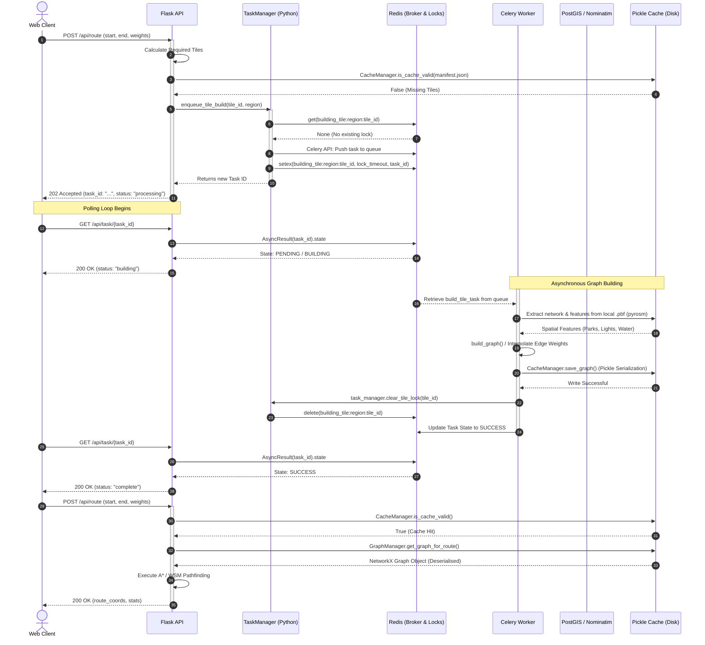

# Async Request Flow Sequence Diagram

This sequence diagram illustrates the decoupled architecture of the Scenic Pathfinding Engine, showcasing how heavy geospatial processing is offloaded to Celery workers while the Flask API remains responsive. Note the distinct separation between the Redis Message Broker (which also handles concurrency locks) and the Disk-based Pickle Cache.

## Architectural Justification
*   **Decoupling:** The heavy `build_graph()` process (which involves parsing OSM data and cross-referencing PostGIS) can take over 60 seconds for large regions. By offloading this to Celery (Steps 14-22), the Flask API never blocks or hits a gateway timeout.
*   **Concurrency Control (ADR-005):** The introduction of the `TaskManager` interacting with Redis locks (Steps 6-9) guarantees `<NFR-03>`: If 4 users request a route through the same uncached area simultaneously, only 1 Celery worker builds the tile; the other 3 requests share the lock and poll the same `task_id`.
*   **Polling:** The client manages latency through active asynchronous polling (Steps 11-13), providing UI feedback ("Building network...") rather than a frozen browser page.
*   **Caching Strategy (ADR-007):** The second `POST` request (Step 26) leverages the Disk Cache generated by the worker. The Flask API immediately jumps into memory-bound A* traversal, achieving the sub-2-second `<NFR-01>` response goal.
