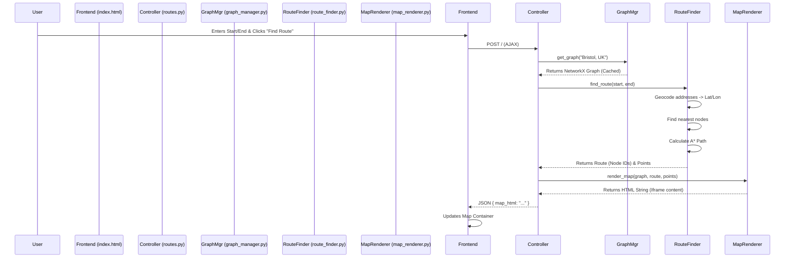

# Project Flow & Architecture

This document outlines the structure and execution flow of the PathFinder MVP to assist with maintenance and future development.

## 1. High-Level Architecture

The application follows a standard **Model-View-Controller (MVC)** pattern (adapted for Flask):

-   **Controller**: `app/routes.py` handles incoming HTTP requests.
-   **Model/Services**: `app/services/` contains the business logic (Graph data, Routing algorithm, Map generation).
-   **View**: `app/templates/` and `app/static/` handle the user interface.

## 2. Execution Flow

### A. Application Startup
1.  **`run.py`**: The entry point. It imports the `app` instance.
2.  **`app/__init__.py`**: The `create_app()` factory function initializes the Flask app and registers blueprints (routes).
3.  **`config.py`**: Loads configuration settings (e.g., `DEFAULT_CITY`).

### B. User Request (Find Route)
When a user clicks "Find Route", the following sequence occurs:

## 3. File Breakdown

### Root Directory
-   **`run.py`**: Script to launch the server.
-   **`config.py`**: Global settings (Debug mode, Secret keys, Default City).
-   **`requirements.txt`**: Python dependencies.
-   **`start.bat`**: Windows batch script to run the app with the correct Python environment.

### App Directory (`app/`)
-   **`__init__.py`**: Setup file. Contains `create_app()`.

#### Services (`app/services/`)
This is where the core logic lives.
-   **`graph_manager.py`**:
    -   **Role**: Singleton-like manager for the OSM graph.
    -   **Key Method**: `get_graph(city_name)` - Downloads or retrieves the cached street network.
-   **`route_finder.py`**:
    -   **Role**: Calculates the path.
    -   **Key Method**: `find_route(start, end)` - Converts addresses to coordinates and runs the A* algorithm.
-   **`map_renderer.py`**:
    -   **Role**: Visualisation.
    -   **Key Method**: `render_map(...)` - Uses Folium to draw the map, markers, and polyline.

#### Routes (`app/routes.py`)
-   **`routes.py`**: The traffic cop. It receives the form data, calls the services in order, and returns the result to the frontend.

#### Frontend (`app/templates/` & `app/static/`)
-   **`index.html`**: The single-page interface. Contains the Sidebar and Map container. Handles the AJAX form submission via JavaScript.
-   **`css/style.css`**: Custom styling, including the Dark Mode map filter.

## 4. How to Edit

-   **To change the City**: Edit `DEFAULT_CITY` in `config.py`.
-   **To change the Algorithm**: Modify `nx.shortest_path` arguments in `app/services/route_finder.py`.
-   **To change the Map Style**: Edit `folium.Map` parameters in `app/services/map_renderer.py` or the CSS filters in `style.css`.
-   **To change the UI**: Edit `app/templates/index.html` (structure) or `app/static/css/style.css` (looks).
